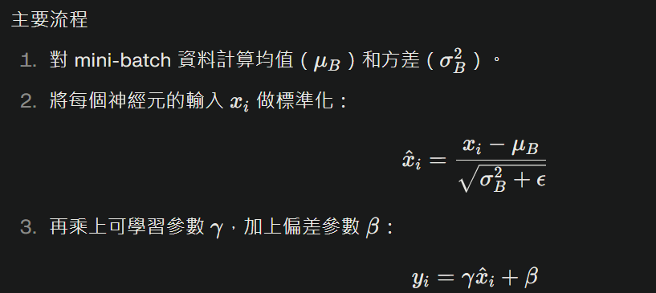

# 層（Layer）

## 人工智能（AI）神經網絡中的每個層（Layer）功能不同，下面介紹常見的幾種層及其作用：

### 輸出層 (Input Layer):
  - **功能**：接收原始數據（如圖像像素、語音信號或文本特徵）。
  - **作用**：將外部數據轉換為網絡可以處理的形式，不進行計算，只是數據的入口。

### 隱藏層 (Hidden Layers):
  - **功能**：介於輸入層和輸出層之間，負責處理和轉換數據。
  - **作用**：從數據中抽取特徵，進行非線性映射，學習複雜模式。
  - **特殊層**

<details>
<summary>隱藏層的詳細介紹</summary>

# Dence / Fully‑connected (全連接層)：
- 最基本的層，把上一層的所有輸入節點都連接到本層的每個神經元；適合**表格資料、分類/回歸**。
- 它會對輸入資料進行加權線性組合，再加上一個偏差項（bias），公式如下：
### y(輸出) = W(權重矩陣)∙x(輸入) + b(偏差向)
- **特點**:有更高的靈活度和學習能力，通常需要硬體(ex:GPU)來提升運算速度。

```python
from tensorflow.keras.layers import Dense

layer = Dense(128, activation='relu')# 建立128個神經元的全連接層

```
---
# Convolution / Conv (卷積層)
- 深度學習中**圖像處理**任務的重要核心。

- 卷積層的主要作用是利用「卷積核」或「濾波器」在輸入資料（如影像）上滑動，提取區域性特徵，例如邊緣、顏色或紋理。每個卷積核會學習一組權重，能針對不同圖像特徵有不同的敏感度。

- 卷積層的關鍵參數:
  - kernel size（卷積核大小）
  - stride（步長）
  - padding（填補法，有「valid」與「same」兩種）
  - filter/深度數量

```python
from tensorflow.keras.layers import Conv2D

layer = Conv2D(filters=32, kernel_size=(3,3), activation='relu')
# 產生 32 張特徵圖，每個卷積核大小 3×3
```
---

# Pooling Layer (池化層)
- 捲積神經網路（CNN）裡的關鍵組件，通常放在卷積層之後，用來降低特徵圖（feature map）的尺寸，同時保留重要特徵。
## 主要功能
  - 降維、縮小特徵圖大小：例如把原本 32×32 的影像縮小成 16×16。
  - **減少模型參數量**：**加快運算速度**，降低硬體負擔。
  - 提升模型穩定性：減少過擬合，使模型更能適應不同新資料。

- 池化層會用一個固定大小的視窗（如 2×2 或 3×3），在特徵圖上滑動，對每個區塊進行運算。(ex:Max Pooling（最大池化）、Average Pooling（平均池化）)

- 重要參數
  - Kernel Size（池化窗口大小）
  - Stride（步長）：控制視窗滑多遠，通常設為和窗口同樣大小。
  - 無參數可學習：池化層不會增加可訓練參數。

```python
from tensorflow.keras.layers import MaxPooling2D

layer = MaxPooling2D(pool_size=(2,2))
```
---

# Recurrent(RNN / LSTM / GRU) (循環層)
- 循環層，也稱循環神經網路（Recurrent Neural Network, RNN），是一種非常適合處理「序列型資料」的深度學習架構。它有一項特殊能力，就是記憶前面的輸入，並把它融入到目前的運算中。

- 運作原理
  - 輸入序列：每次輸入資料一個元素，
  - 隱藏狀態（記憶）：會被更新，每一步都會用到前一時刻的隱藏狀態。
  - 回饋機制：每一層的輸出會被用來影響下一步運算——這就是「循環」的意思。
- **時間序列預測**:根據 過去資料 去預測 未來走向。

    詳細前往[RNN](./RNN.md)

---
# 特殊層
# Normalization（BatchNorm / LayerNorm）(正規化層)
## ✨標準化激活值

- **穩定激活分布，避免梯度問題**
- **加快模型收斂速度**
- **提升泛化能力**
- **增強深層網路與現代架構表現**
- **可學參數讓模型更靈活**

### 1.Batch Normalization (批次正規化)
#### 運作:
- 把某一層的輸入（通常是全連接層、卷積層的結果）進行正規化處理。
- 目標：讓每批（batch）資料的輸入分布，平均值變成 0，方差變成 1，避免分布過於分散、難以訓練。
- 通常在非線性激活函數（如 ReLU, tanh）之前使用。

#### 主要流程
1. 對 mini-batch 資料計算均值和方差
2. 將每個神經元的輸入 做標準化
3. 再乘上可學習參數γ，加上偏差參數β
- 其中，γ,β會在訓練過程中自動學習，ϵ是個很小的數，防止除以零。


#### 常見位置
- 通常放在「全連接層」或「卷積層」之後、激活函數之前。
---
# Dropout (隨機丟棄層)
- 深度學習中很常用的一種「正則化」技術，目的是防止神經網路過擬合（overfitting）。

### 運作原理
- 在神經網路訓練時，Dropout 會用設定好的機率（例如 0.5）隨機「關閉」部份神經元，讓它們在這次訓練（前向和反向傳播）裡都沒有參與 。這種做法讓模型不會過度依賴單一神經元，強迫其他神經元「補位」，從而學到更強健、多元的特徵。
  - 每次訓練 mini-batch 時，都會有不同神經元被「暫時禁用」。
  - 可以想像訓練過程中同時訓練了許多結構略有不同的網路。
  - 減少神經元間的共適應（co-adaptation），讓模型泛化能力大增。

```python
from tensorflow.keras.layers import Dropout

layer = Dropout(0.5)
```

</details>

### 輸出層 (Output Layer):
  - **功能**：輸出最終預測結果。
  - **作用**：根據任務（分類、回歸等）生成結果，如分類概率或回歸值。
  - 節點數量通常和輸出類別數對應。

# [返回](../main.md)
