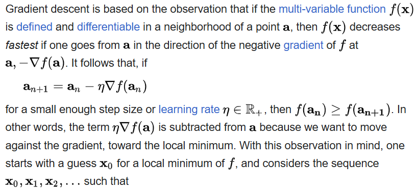
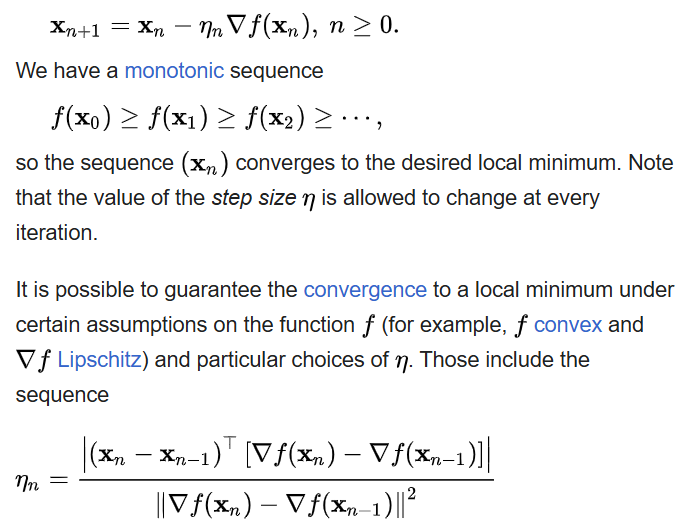
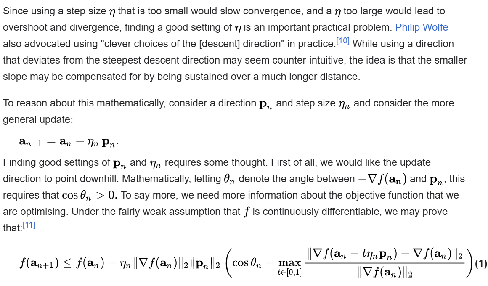
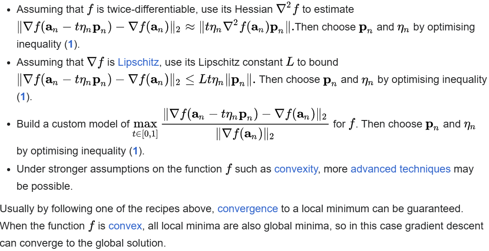
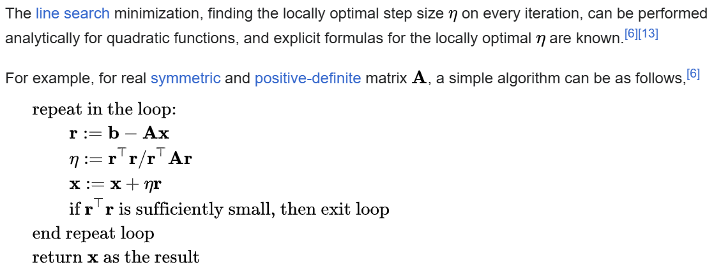
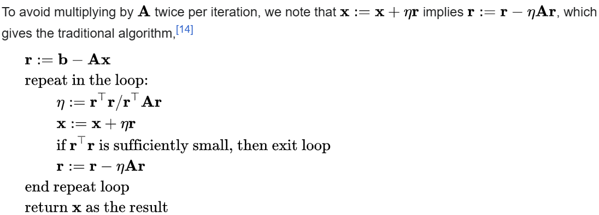

# Gradient descent 梯度下降

#### Gradient descent is a method(方法) for unconstrained(無束約的) mathematical optimization(數學最佳化). It is a first-order iterative algorithm(迭代演算法) for minimizing(最小化) a differentiable(可微分化的) multivariate function(多元函數).

### The idea is to take repeated steps(反覆迭代) in the opposite direction of the gradient(梯度的反方向) (or approximate gradient(近似梯度)) of the function(函數) at the current point(當前點), because this is the direction(方向) of steepest descent(最陡). Conversely(相反), stepping in the direction of the gradient(梯度方向) will lead to a trajectory(軌跡) that maximizes(最大化) that function; the procedure(過程) is then known as gradient ascent(梯度上升). It is particularly useful(特別好用) in machine learning(機器學習) for minimizing(最小化) the cost(成本函數) or loss(損失函數) function. Gradient descent should not be confused with **local search algorithms(局部搜尋演算法)**, although both are iterative methods(迭代方法) for optimization(優化).

---

## Description

### An analogy(類比) for understanding gradient descent
The basic intuition behind gradient descent can be illustrated by a hypothetical scenario. People are stuck in the mountains and are trying to get down (i.e.(也就是說), trying to find the global minimum). There is heavy fog such that visibility is extremely low. Therefore, the path down the mountain is not visible, so they must use local information to find the minimum. They can use the method of gradient descent, which involves looking at the steepness of the hill at their current position, then proceeding in the direction with the steepest descent (i.e., downhill). If they were trying to find the top of the mountain (i.e., the maximum), then they would proceed in the direction of steepest ascent (i.e., uphill). Using this method, they would eventually find their way down the mountain or possibly get stuck in some hole (i.e., local minimum or saddle point), like a mountain lake. However, assume also that the steepness of the hill is not immediately obvious with simple observation, but rather it requires a sophisticated instrument to measure, which the people happen to have at that moment. It takes quite some time to measure the steepness of the hill with the instrument. Thus, they should minimize their use of the instrument if they want to get down the mountain before sunset. The difficulty then is choosing the frequency at which they should measure the steepness of the hill so as not to go off track.

In this analogy, the people represent the algorithm, and the path taken down the mountain represents the sequence of parameter settings that the algorithm will explore. The steepness of the hill represents the slope of the function at that point. The instrument used to measure steepness is differentiation. The direction they choose to travel in aligns with the gradient of the function at that point. The amount of time they travel before taking another measurement is the step size.

### Choosing the step size and descent direction

---

## Solution of a linear system(線型函數的解)
Gradient descent can be used to solve a **system of linear equations**

reformulated as a quadratic minimization problem. If the system matrix **_A_** is real symmetric and positive-definite, an objective function is defined as the quadratic function, with minimization of

so that

For a general real matrix **_A_**, linear least squares define

In traditional linear least squares for real **_A_** and **_b_** the Euclidean norm is used, in which case

### Geometric behavior and residual orthogonality

As shown in the image on the right, steepest descent converges slowly due to the high condition number of**_A_**, and the orthogonality of residuals forces each new direction to undo the overshoot from the previous step. The result is a path that zigzags toward the solution. This inefficiency is one reason conjugate gradient or preconditioning methods are preferred.
---

## References
1. https://en.wikipedia.org/wiki/Gradient_descent
2. https://books.google.com.tw/books?id=iD5s0iKXHP8C&pg=PA131&redir_esc=y#v=onepage&q&f=false
3. https://web.stanford.edu/~boyd/cvxbook/bv_cvxbook.pdf#page=471
---

# [返回](../../main.md)