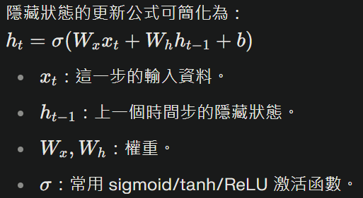

# 循環/遞迴神經網路（Recurrent neural network：RNN）
##### RNN是神經網路的一種。是在機器學習領域用來處理「序列資料」的深度學習模型

## 核心想法
- 獨特之處在於記憶能力：它可以把**之前**的資訊帶到下一步，反映在計算中。
- 在每個時間步，RNN會收到序列中的一個元素作為**輸入**，再利用上一步的「隱藏狀態」一起做出新的隱藏狀態。
- 新的隱藏狀態把目前為止看到的資訊都「記住」，並且能產生一個新的輸出。

## 運作流程
1. 取出序列中的第一個元素當作輸入
2. 初始化隱藏狀態
3. 每一步都用目前的序列元素和上一個隱藏狀態計算新的隱藏狀態
4. **隱藏狀態**可以用來計算最終輸出(預測or判斷)

### 應用場景
- 自然語言處理（NLP）：語言模型、文本分類、機器翻譯
- 語音辨識
- 序列**分析**：金融、氣象、影片分析

## 公式

## 優缺點
- **優點**:能記住序列資訊；可做很多序列任務

- **缺點**:原始RNN容易「遺忘**很久以前**」的資訊；訓練時面臨**梯度消失/爆炸**。改良型（如LSTM/GRU）能克服這些問題

延伸閱讀

[LSTM](./LSTM.md) 長短期記憶神經網路

[GRU](./GRU.md) 閘門神經網路

## Reference
1. https://zh-yue.wikipedia.org/wiki/%E9%81%9E%E8%BF%B4%E7%A5%9E%E7%B6%93%E7%B6%B2%E7%B5%A1#%E9%96%98%E9%96%80%E9%81%9E%E8%BF%B4%E5%96%AE%E4%BD%8D

# [返回](../../main.md)