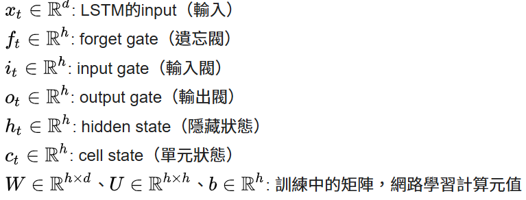
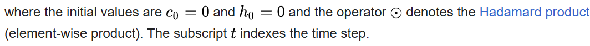
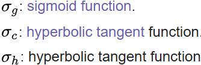
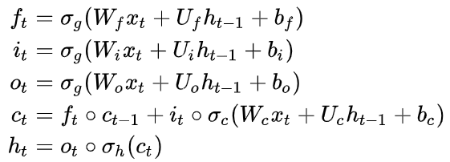

# Long Short-Term Memory / LSTM 長短期記憶神經網路

### 是現代深度學習中時間序列和序列分析的重要基礎結構

#### 用於解決"RNN"在長序列學習中梯度消失和梯度爆炸等問題，之後被廣泛應用於語音識別、語言建模、機器翻譯、情感分析、時間序列預測、醫療診斷和音樂生成...
#### 可作為複雜的非線性單元用於構造更大型

### 結構與核心機制
#### 分成三個們和一個細胞狀態
  - 遺忘門（Forget Gate）：決定要遺忘多少來自前一狀態的資訊
  - 輸入門（Input Gate）：決定目前新進資訊中哪些部分要記錄到細胞狀態裡
  - 輸出門（Output Gate）：決定要從細胞狀態中輸出哪些資訊，作為當前序列的結果
  - 細胞狀態（Cell State）：像一條資訊通道，負責保存、傳遞和更新整個序列過程中的重要記憶
  

## Equation 方程

### Activation Function 激活函數

## Peephole LSTM 窺孔LSTM
- Peephole connections allow the gates to access the **constant error carousel (CEC) 恆定誤差輪播**, whose activation is the cell state.

