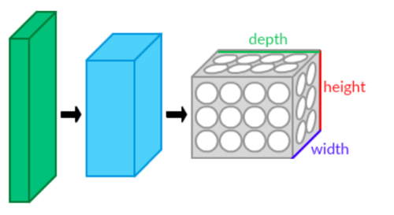

# 神經網路架構（簡要說明）

神經網路架構（Neural Network Architecture）又名**類神經網路**是指網路中各層的類型、順序與連接方式，以及輸入/輸出的形狀與資料流動規則。它決定模型的表示能力、計算成本與適用場景。

## 組成要素（重點）
- 前往[Layer(層)](./Files/Document/Layer.md) 
- [啟動函數](./Files/Document/Activation_function.md)（Activation）：非線性變換，例如 ReLU、Sigmoid、Tanh、GELU。  
- [損失函數](./Files/Document/Loss_function.md)（Loss）：評估模型輸出與目標差距（分類常用 Cross‑Entropy，回歸用 MSE）。  
- [優化器](./Files/Document/Optimizer.md)（Optimizer）：更新參數的方法，如 SGD、Adam。  
- [結構模式](./Files/Document/Architectural_pattern.md)：殘差（Residual）/ 跳接（Skip）、多分支（Inception 類型）、編碼器‑解碼器（Encoder‑Decoder）等。

## 常見架構類型（用途）
- [MLP](./Files/Document/MLP.md)（多層感知器）：表格資料、簡單分類/回歸。  
- 前往[CNN](./Files/Document/CNN.md)（卷積神經網路）：影像、視覺特徵提取。  
- 前往[RNN](./Files/Document/RNN.md) / 前往[LSTM](./Files/Document/LSTM.md) / 前往[GRU](./Files/Document/GRU.md)：序列資料（文字、時間序列、語音）。  
- Transformer（Self‑Attention 為核心）：NLP、序列建模與大型預訓練模型。  
- Autoencoder / GAN / GNN：降維、生成式建模、圖資料處理。

## 設計考量（實務要點）
- 深度（層數）vs 寬度（每層神經元數）：影響表現與過擬合風險。  
- 感受野（Receptive Field）：尤其在 CNN 中決定能抓多大範圍的特徵。 

About Receptive Field

## In the context of neural networks

#### The term receptive field is also used in the context of artificial neural networks, most often in relation to convolutional neural networks (CNNs). So, in a neural network context, the receptive field is defined as the size of the region in the input that produces the feature. Basically, it is a measure of association of an output feature (of any layer) to the input region (patch). It is important to note that the idea of receptive fields applies to local operations (i.e. convolution, pooling). As an example, in motion-based tasks, like video prediction and optical flow estimation, large motions need to be captured (displacements of pixels in a 2D grid), so an adequate receptive field is required. Specifically, the receptive field should be sufficient if it is larger than the largest flow magnitude of the dataset. There are a lot of ways that one can increase the receptive field on a CNN.

#### When used in this sense, the term adopts a meaning reminiscent of receptive fields in actual biological nervous systems. CNNs have a distinct architecture, designed to mimic the way in which real animal brains are understood to function; instead of having every neuron in each layer connect to all neurons in the next layer (Multilayer perceptron), the neurons are arranged in a 3-dimensional structure in such a way as to take into account the spatial relationships between different neurons with respect to the original data. Since CNNs are used primarily in the field of computer vision, the data that the neurons represent is typically an image; each input neuron represents one pixel from the original image. The first layer of neurons is composed of all the input neurons; neurons in the next layer will receive connections from some of the input neurons (pixels), but not all, as would be the case in a MLP and in other traditional neural networks. Hence, instead of having each neuron receive connections from all neurons in the previous layer, CNNs use a receptive field-like layout in which each neuron receives connections only from a subset of neurons in the previous (lower) layer. The receptive field of a neuron in one of the lower layers encompasses only a small area of the image, while the receptive field of a neuron in subsequent (higher) layers involves a combination of receptive fields from several (but not all) neurons in the layer before (i. e. a neuron in a higher layer "looks" at a larger portion of the image than does a neuron in a lower layer). In this way, each successive layer is capable of learning increasingly abstract features of the original image. The use of receptive fields in this fashion is thought to give CNNs an advantage in recognizing visual patterns when compared to other types of neural networks.

#### CNN layers arranged in three dimensions :

- [正則化](./Files/Document/Regularization.md)：Dropout、權重衰減、資料擴增、早停等避免過擬合。  
- 正規化層：BatchNorm / LayerNorm 幫助穩定與加速訓練。  
- 訓練細節：學習率與其排程（scheduler）、批次大小、初始化方法對收斂影響最大。  
- 模組化：把常用塊（conv‑bn‑relu、residual block）封裝以利復用與測試。

## 運作流程
1. 前向傳播（Forward Propagation）
- 輸入資料依序經過各層神經元，產生輸出結果。
2. 損失計算（Loss Calculation）
- 比較預測值與真實值，算出誤差（Loss function，如 MSE、Cross-Entropy）。
3. 反向傳播（Backpropagation）
- 根據誤差，利用微分計算每個權重對損失的貢獻。
- 更新權重以減少誤差（使用梯度下降法）。
4. 訓練（Training）
- 重複多次前向＋反向過程，使模型收斂到好的結果。

## 路的學習（訓練）流程
人工神經網路的「學習」過程，就是調整權重（weights）和偏差（bias），讓輸出結果越來越接近正確答案。

1. 前向傳播（Forward Propagation）
  輸入資料 → 通過每層神經元 → 得到輸出結果。
2. 計算誤差（Loss Function）
  比較網路輸出與真實標籤
3. 反向傳播（Backpropagation）
  利用**微分（偏導數）**計算每個權重對誤差的影響。
4. 更新權重（Optimization）
  使用優化演算法（例如 梯度下降 Gradient Descent）更新

## 快速流程（從架構到部署）
1. 根據資料與任務選擇基本架構（例如影像選 CNN）。  
2. 設計層序列、尺寸與參數（kernel、stride、units）。  
3. 設定損失、優化器與正則化策略。  
4. 訓練、驗證並調整超參數（lr、batch size、層數）。  
5. 儲存 checkpoint，轉為推理/部署（注意切換 model.eval()）。

## 重要參數與概念
權重 (Weight) : 控制輸入對輸出的影響程度
偏差 (Bias)	: 調整神經元啟動的閾值
學習率 (Learning Rate) : 每次更新權重的步伐大小
批次大小 (Batch Size) : 一次訓練使用的資料量
Epoch : 所有資料被訓練一次稱一個 epoch
Loss Function : 評估模型好壞的函數
Optimizer : 控制權重更新方式（SGD、Adam等）

## Reference
1. [維基百科](https://en.wikipedia.org/wiki/Neural_network_(machine_learning))
2. [Receptive_field](https://en.wikipedia.org/wiki/Receptive_field)