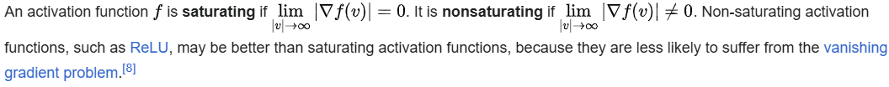
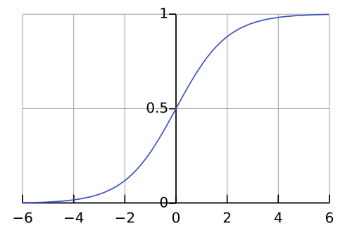
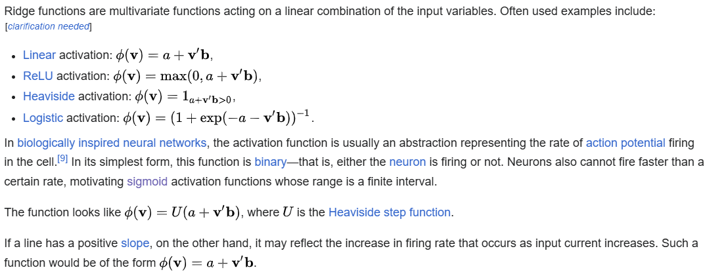
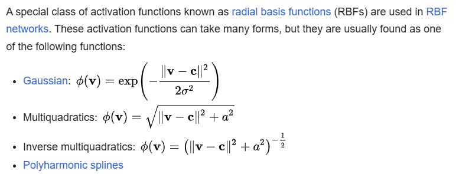
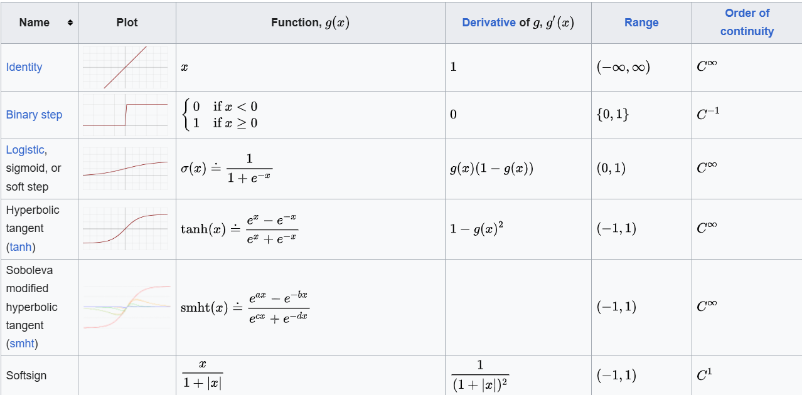
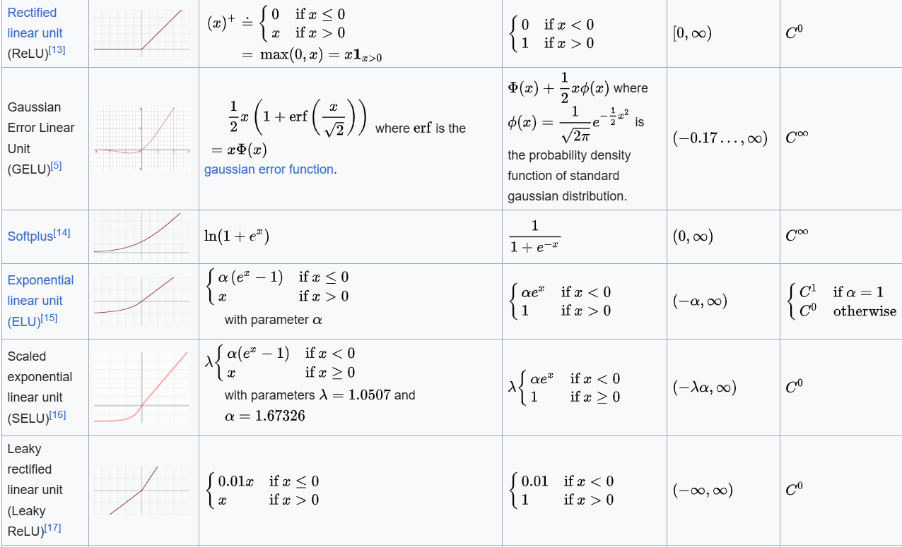
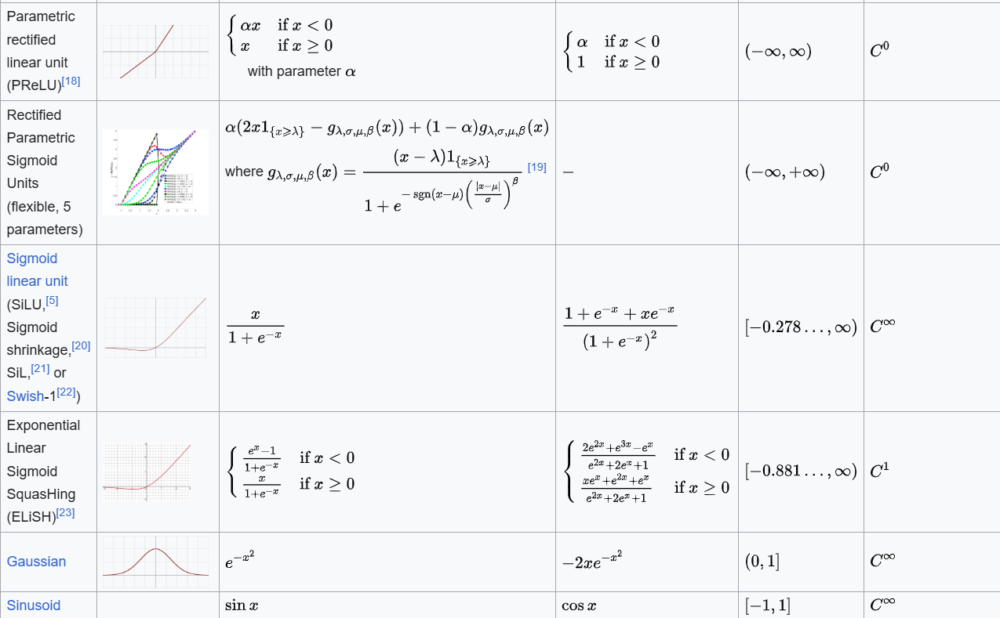
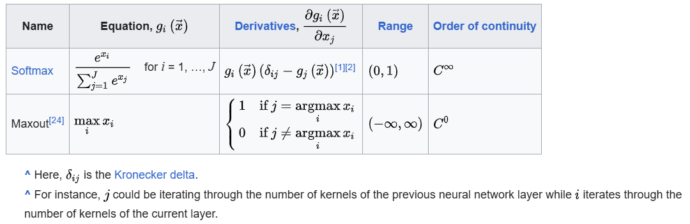

# Activation function 激活函數

#### In artificial neural networks, the activation function of a node is a function that calculates the output of the node based on its individual inputs and their weights. Nontrivial problems can be solved using only a few nodes if the activation function is nonlinear.

#### Modern activation functions include the logistic (sigmoid) function used in the 2012 speech recognition model developed by Hinton et al; the ReLU used in the 2012 AlexNet computer vision model and in the 2015 ResNet model; and the smooth version of the ReLU, the GELU, which was used in the 2018 BERT model.

---

## Comparison of activation functions

#### Aside from their empirical performance, activation functions also have different mathematical properties:

### Nonlinear

#### When the activation function is non-linear, then a two-layer neural network can be proven to be a universal function approximator. This is known as the Universal Approximation Theorem. The identity activation function does not satisfy this property. When multiple layers use the identity activation function, the entire network is equivalent to a single-layer model.

### Range

#### When the range of the activation function is finite, gradient-based training methods tend to be more stable, because pattern presentations significantly affect only limited weights. When the range is infinite, training is generally more efficient because pattern presentations significantly affect most of the weights. In the latter case, smaller learning rates are typically necessary.

### Continuously differentiable

#### This property is desirable for enabling gradient-based optimization methods (ReLU is not continuously differentiable and has some issues with gradient-based optimization, but it is still possible). The binary step activation function is not differentiable at 0, and it differentiates to 0 for all other values, so gradient-based methods can make no progress with it.

### These properties do not decisively influence performance, nor are they the only mathematical properties that may be useful. For instance, the strictly positive range of the softplus makes it suitable for predicting variances in variational autoencoders.

---

## Mathematical details

#### The most common activation functions can be divided into three categories: ridge functions, radial functions and fold functions.

### Ridge activation functions

### Radial activation functions

#### where **_c_** is the vector representing the function center and **_a_** and **_σ_** are parameters affecting the spread of the radius.

### Other examples

#### Periodic functions can serve as activation functions. Usually the sinusoid is used, as any periodic function is decomposable into sinusoids by the Fourier transform.

#### Quadratic activation maps **_x↦x^2_**.

### Folding activation functions

#### Folding activation functions are extensively used in the pooling layers in convolutional neural networks, and in output layers of multiclass classification networks. These activations perform aggregation over the inputs, such as taking the mean, minimum or maximum. In multiclass classification the softmax activation is often used.

### Table of activation functions

#### The following table compares the properties of several activation functions that are functions of one fold **_x_** from the previous layer or layers:

#### The following table lists activation functions that are not functions of a single fold **_x_** from the previous layer or layers:

### Quantum activation functions

#### In quantum neural networks programmed on gate-model quantum computers, based on quantum perceptrons instead of variational quantum circuits, the non-linearity of the activation function can be implemented with no need of measuring the output of each perceptron at each layer. The quantum properties loaded within the circuit such as superposition can be preserved by creating the Taylor series of the argument computed by the perceptron itself, with suitable quantum circuits computing the powers up to a wanted approximation degree. Because of the flexibility of such quantum circuits, they can be designed in order to approximate any arbitrary classical activation function.

---

## References

1. [維基百科](https://en.wikipedia.org/wiki/Activation_function)
2. https://web.archive.org/web/20181006235506/http://didattica.cs.unicam.it/lib/exe/fetch.php?media=didattica:magistrale:kebi:ay_1718:ke-11_neural_networks.pdf
3. https://www.inass.org/2019/2019063019.pdf
4. https://hal.science/hal-03753170/file/Cybenko1989.pdf

# [返回](../../ANN.md)