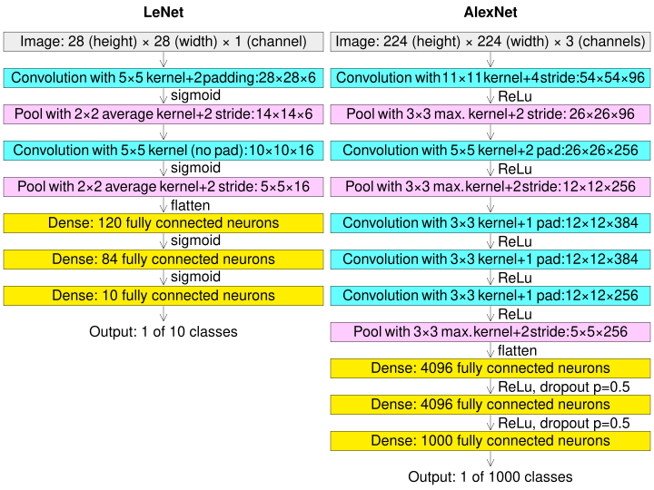
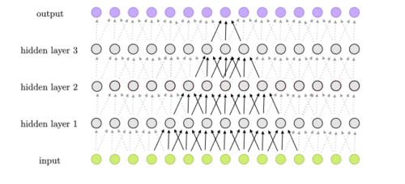
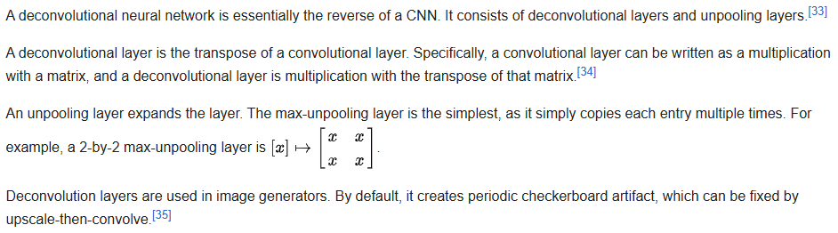
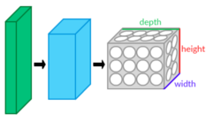

# Convolutional neural network / CNN 卷積神經網路

#### A convolutional neural network (CNN) is a type of feedforward neural network that learns features via filter (or kernel) optimization. This type of deep learning network has been applied to process and make predictions from many different types of data including text, images and audio. Convolution-based networks are the de-facto standard in deep learning-based approaches to computer vision and image processing, and have only recently been replaced—in some cases—by newer deep learning architectures such as the transformer.

#### Vanishing gradients and exploding gradients, seen during backpropagation in earlier neural networks, are prevented by the regularization that comes from using shared weights over fewer connections. For example, for each neuron in the fully-connected layer, 10,000 weights would be required for processing an image sized 100 × 100 pixels. However, applying cascaded convolution (or cross-correlation) kernels, only 25 weights for each convolutional layer are required to process 5x5-sized tiles. Higher-layer features are extracted from wider context windows, compared to lower-layer features.

#### Some applications of CNNs include:

#### image and video recognition
#### recommender systems
#### image classification
#### image segmentation
#### medical image analysis
#### natural language processing
#### brain–computer interfaces and
#### financial time series

#### CNNs are also known as shift invariant or space invariant artificial neural networks, based on the shared-weight architecture of the convolution kernels or filters that slide along input features and provide translation-equivariant responses known as feature maps. Counter-intuitively, most convolutional neural networks are not invariant to translation, due to the downsampling operation they apply to the input.

#### Feedforward neural networks are usually fully connected networks, that is, each neuron in one layer is connected to all neurons in the next layer. The "full connectivity" of these networks makes them prone to overfitting data. Typical ways of regularization, or preventing overfitting, include: penalizing parameters during training (such as weight decay) or trimming connectivity (skipped connections, dropout, etc.) Robust datasets also increase the probability that CNNs will learn the generalized principles that characterize a given dataset rather than the biases of a poorly-populated set.

#### Convolutional networks were inspired by biological processes in that the connectivity pattern between neurons resembles the organization of the animal visual cortex. Individual cortical neurons respond to stimuli only in a restricted region of the visual field known as the receptive field. The receptive fields of different neurons partially overlap such that they cover the entire visual field.

#### CNNs use relatively little pre-processing compared to other image classification algorithms. This means that the network learns to optimize the filters (or kernels) through automated learning, whereas in traditional algorithms these filters are hand-engineered. This simplifies and automates the process, enhancing efficiency and scalability overcoming human-intervention bottlenecks.

---

## Architecture

#### A convolutional neural network consists of an input layer, hidden layers and an output layer. In a convolutional neural network, the hidden layers include one or more layers that perform convolutions. Typically this includes a layer that performs a dot product of the convolution kernel with the layer's input matrix. This product is usually the Frobenius inner product, and its activation function is commonly ReLU. As the convolution kernel slides along the input matrix for the layer, the convolution operation generates a feature map, which in turn contributes to the input of the next layer. This is followed by other layers such as pooling layers, fully connected layers, and normalization layers. Here it should be noted how close a convolutional neural network is to a matched filter.

### Convolutional layers

#### In a CNN, the input is a tensor with shape:

#### (number of inputs) × (input height) × (input width) × (input channels)

#### After passing through a convolutional layer, the image becomes abstracted to a feature map, also called an activation map, with shape:

#### (number of inputs) × (feature map height) × (feature map width) × (feature map channels).

#### Convolutional layers convolve the input and pass its result to the next layer. This is similar to the response of a neuron in the visual cortex to a specific stimulus. Each convolutional neuron processes data only for its receptive field.

#### Although fully connected feedforward neural networks can be used to learn features and classify data, this architecture is generally impractical for larger inputs (e.g., high-resolution images), which would require massive numbers of neurons because each pixel is a relevant input feature. A fully connected layer for an image of size 100 × 100 has 10,000 weights for each neuron in the second layer. Convolution reduces the number of free parameters, allowing the network to be deeper. For example, using a 5 × 5 tiling region, each with the same shared weights, requires only 25 neurons. Using shared weights means there are many fewer parameters, which helps avoid the vanishing gradients and exploding gradients problems seen during backpropagation in earlier neural networks.

#### To speed processing, standard convolutional layers can be replaced by depthwise separable convolutional layers, which are based on a depthwise convolution followed by a pointwise convolution. The depthwise convolution is a spatial convolution applied independently over each channel of the input tensor, while the pointwise convolution is a standard convolution restricted to the use of **_1 x 1_** kernels.

### Pooling Layers

#### Convolutional networks may include local and/or global pooling layers along with traditional convolutional layers. Pooling layers reduce the dimensions of data by combining the outputs of neuron clusters at one layer into a single neuron in the next layer. Local pooling combines small clusters, tiling sizes such as 2 × 2 are commonly used. Global pooling acts on all the neurons of the feature map. There are two common types of pooling in popular use: max and average. Max pooling uses the maximum value of each local cluster of neurons in the feature map, while average pooling takes the average value

### Fully connected layers

#### Fully connected layers connect every neuron in one layer to every neuron in another layer. It is the same as a traditional multilayer perceptron neural network (MLP). The flattened matrix goes through a fully connected layer to classify the images.

### Receptive field

#### In neural networks, each neuron receives input from some number of locations in the previous layer. In a convolutional layer, each neuron receives input from only a restricted area of the previous layer called the neuron's receptive field. Typically the area is a square (e.g. 5 by 5 neurons). Whereas, in a fully connected layer, the receptive field is the entire previous layer. Thus, in each convolutional layer, each neuron takes input from a larger area in the input than previous layers. This is due to applying the convolution over and over, which takes the value of a pixel into account, as well as its surrounding pixels. When using dilated layers, the number of pixels in the receptive field remains constant, but the field is more sparsely populated as its dimensions grow when combining the effect of several layers.

#### To manipulate the receptive field size as desired, there are some alternatives to the standard convolutional layer. For example, atrous or dilated convolution expands the receptive field size without increasing the number of parameters by interleaving visible and blind regions. Moreover, a single dilated convolutional layer can comprise filters with multiple dilation ratios, thus having a variable receptive field size.

### Weights 

#### Each neuron in a neural network computes an output value by applying a specific function to the input values received from the receptive field in the previous layer. The function that is applied to the input values is determined by a vector of weights and a bias (typically real numbers). Learning consists of iteratively adjusting these biases and weights.

#### The vectors of weights and biases are called filters and represent particular features of the input (e.g., a particular shape). A distinguishing feature of CNNs is that many neurons can share the same filter. This reduces the memory footprint because a single bias and a single vector of weights are used across all receptive fields that share that filter, as opposed to each receptive field having its own bias and vector weighting.

### Deconvolutional

---

## Distinguishing features

#### In the past, traditional multilayer perceptron (MLP) models were used for image recognition. However, the full connectivity between nodes caused the curse of dimensionality, and was computationally intractable with higher-resolution images. A 1000×1000-pixel image with RGB color channels has 3 million weights per fully-connected neuron, which is too high to feasibly process efficiently at scale.

#### For example, in CIFAR-10, images are only of size 32×32×3 (32 wide, 32 high, 3 color channels), so a single fully connected neuron in the first hidden layer of a regular neural network would have 32*32*3 = 3,072 weights. A 200×200 image, however, would lead to neurons that have 200*200*3 = 120,000 weights.

#### Also, such network architecture does not take into account the spatial structure of data, treating input pixels which are far apart in the same way as pixels that are close together. This ignores locality of reference in data with a grid-topology (such as images), both computationally and semantically. Thus, full connectivity of neurons is wasteful for purposes such as image recognition that are dominated by spatially local input patterns.

#### Convolutional neural networks are variants of multilayer perceptrons, designed to emulate the behavior of a visual cortex. These models mitigate the challenges posed by the MLP architecture by exploiting the strong spatially local correlation present in natural images. As opposed to MLPs, CNNs have the following distinguishing features:

- #### 3D volumes of neurons. The layers of a CNN have neurons arranged in 3 dimensions: width, height and depth. Where each neuron inside a convolutional layer is connected to only a small region of the layer before it, called a receptive field. Distinct types of layers, both locally and completely connected, are stacked to form a CNN architecture.

- 
- 

---

## References 參考

1. https://en.wikipedia.org/wiki/Convolutional_neural_network

# [返回](../../ANN.md)