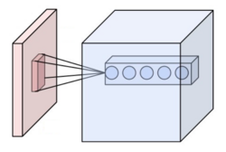
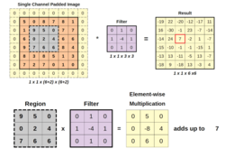
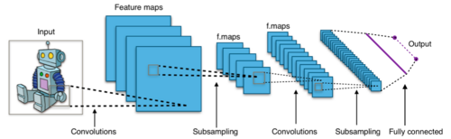
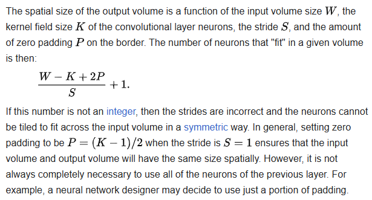
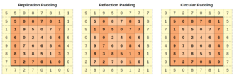
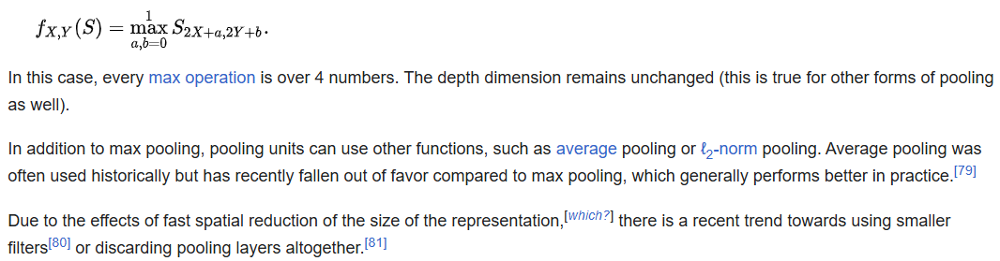
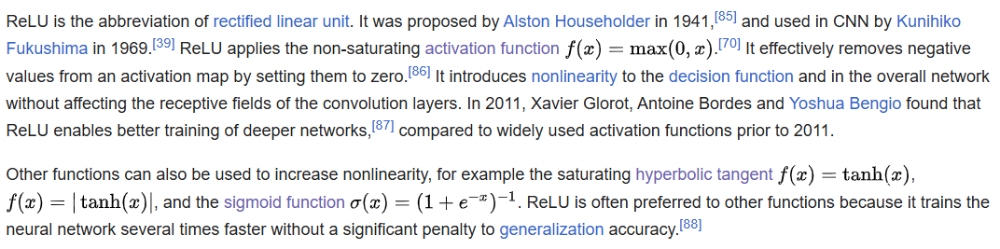

# Convolutional neural network / CNN 卷積神經網路

#### A convolutional neural network (CNN) is a type of feedforward neural network that learns features via filter (or kernel) optimization. This type of deep learning network has been applied to process and make predictions from many different types of data including text, images and audio. Convolution-based networks are the de-facto standard in deep learning-based approaches to computer vision and image processing, and have only recently been replaced—in some cases—by newer deep learning architectures such as the transformer.

#### Vanishing gradients and exploding gradients, seen during backpropagation in earlier neural networks, are prevented by the regularization that comes from using shared weights over fewer connections. For example, for each neuron in the fully-connected layer, 10,000 weights would be required for processing an image sized 100 × 100 pixels. However, applying cascaded convolution (or cross-correlation) kernels, only 25 weights for each convolutional layer are required to process 5x5-sized tiles. Higher-layer features are extracted from wider context windows, compared to lower-layer features.

#### Some applications of CNNs include:

#### - **image and video recognition**
#### - **recommender systems**
#### - **image classification**
#### - **image segmentation**
#### - **medical image analysis**
#### - **natural language processing**
#### - **brain–computer interfaces** and
#### - **financial time series**

#### CNNs are also known as shift invariant or space invariant artificial neural networks, based on the shared-weight architecture of the convolution kernels or filters that slide along input features and provide translation-equivariant responses known as feature maps. Counter-intuitively, most convolutional neural networks are not invariant to translation, due to the downsampling operation they apply to the input.

#### Feedforward neural networks are usually fully connected networks, that is, each neuron in one layer is connected to all neurons in the next layer. The "full connectivity" of these networks makes them prone to overfitting data. Typical ways of regularization, or preventing overfitting, include: penalizing parameters during training (such as weight decay) or trimming connectivity (skipped connections, dropout, etc.) Robust datasets also increase the probability that CNNs will learn the generalized principles that characterize a given dataset rather than the biases of a poorly-populated set.

#### Convolutional networks were inspired by biological processes in that the connectivity pattern between neurons resembles the organization of the animal visual cortex. Individual cortical neurons respond to stimuli only in a restricted region of the visual field known as the receptive field. The receptive fields of different neurons partially overlap such that they cover the entire visual field.

#### CNNs use relatively little pre-processing compared to other image classification algorithms. This means that the network learns to optimize the filters (or kernels) through automated learning, whereas in traditional algorithms these filters are hand-engineered. This simplifies and automates the process, enhancing efficiency and scalability overcoming human-intervention bottlenecks.

---

## Architecture

#### A convolutional neural network consists of an input layer, hidden layers and an output layer. In a convolutional neural network, the hidden layers include one or more layers that perform convolutions. Typically this includes a layer that performs a dot product of the convolution kernel with the layer's input matrix. This product is usually the Frobenius inner product, and its activation function is commonly ReLU. As the convolution kernel slides along the input matrix for the layer, the convolution operation generates a feature map, which in turn contributes to the input of the next layer. This is followed by other layers such as pooling layers, fully connected layers, and normalization layers. Here it should be noted how close a convolutional neural network is to a matched filter.

### Convolutional layers

#### In a CNN, the input is a tensor with shape:

#### (number of inputs) × (input height) × (input width) × (input channels)

#### After passing through a convolutional layer, the image becomes abstracted to a feature map, also called an activation map, with shape:

#### (number of inputs) × (feature map height) × (feature map width) × (feature map channels).

#### Convolutional layers convolve the input and pass its result to the next layer. This is similar to the response of a neuron in the visual cortex to a specific stimulus. Each convolutional neuron processes data only for its receptive field.

#### Although fully connected feedforward neural networks can be used to learn features and classify data, this architecture is generally impractical for larger inputs (e.g., high-resolution images), which would require massive numbers of neurons because each pixel is a relevant input feature. A fully connected layer for an image of size 100 × 100 has 10,000 weights for each neuron in the second layer. Convolution reduces the number of free parameters, allowing the network to be deeper. For example, using a 5 × 5 tiling region, each with the same shared weights, requires only 25 neurons. Using shared weights means there are many fewer parameters, which helps avoid the vanishing gradients and exploding gradients problems seen during backpropagation in earlier neural networks.

#### To speed processing, standard convolutional layers can be replaced by depthwise separable convolutional layers, which are based on a depthwise convolution followed by a pointwise convolution. The depthwise convolution is a spatial convolution applied independently over each channel of the input tensor, while the pointwise convolution is a standard convolution restricted to the use of **_1 x 1_** kernels.

### Pooling Layers

#### Convolutional networks may include local and/or global pooling layers along with traditional convolutional layers. Pooling layers reduce the dimensions of data by combining the outputs of neuron clusters at one layer into a single neuron in the next layer. Local pooling combines small clusters, tiling sizes such as 2 × 2 are commonly used. Global pooling acts on all the neurons of the feature map. There are two common types of pooling in popular use: max and average. Max pooling uses the maximum value of each local cluster of neurons in the feature map, while average pooling takes the average value

### Fully connected layers

#### Fully connected layers connect every neuron in one layer to every neuron in another layer. It is the same as a traditional multilayer perceptron neural network (MLP). The flattened matrix goes through a fully connected layer to classify the images.

### Receptive field

#### In neural networks, each neuron receives input from some number of locations in the previous layer. In a convolutional layer, each neuron receives input from only a restricted area of the previous layer called the neuron's receptive field. Typically the area is a square (e.g. 5 by 5 neurons). Whereas, in a fully connected layer, the receptive field is the entire previous layer. Thus, in each convolutional layer, each neuron takes input from a larger area in the input than previous layers. This is due to applying the convolution over and over, which takes the value of a pixel into account, as well as its surrounding pixels. When using dilated layers, the number of pixels in the receptive field remains constant, but the field is more sparsely populated as its dimensions grow when combining the effect of several layers.

#### To manipulate the receptive field size as desired, there are some alternatives to the standard convolutional layer. For example, atrous or dilated convolution expands the receptive field size without increasing the number of parameters by interleaving visible and blind regions. Moreover, a single dilated convolutional layer can comprise filters with multiple dilation ratios, thus having a variable receptive field size.

### Weights 

#### Each neuron in a neural network computes an output value by applying a specific function to the input values received from the receptive field in the previous layer. The function that is applied to the input values is determined by a vector of weights and a bias (typically real numbers). Learning consists of iteratively adjusting these biases and weights.

#### The vectors of weights and biases are called filters and represent particular features of the input (e.g., a particular shape). A distinguishing feature of CNNs is that many neurons can share the same filter. This reduces the memory footprint because a single bias and a single vector of weights are used across all receptive fields that share that filter, as opposed to each receptive field having its own bias and vector weighting.

### Deconvolutional

---

## Distinguishing features

#### In the past, traditional multilayer perceptron (MLP) models were used for image recognition. However, the full connectivity between nodes caused the curse of dimensionality, and was computationally intractable with higher-resolution images. A 1000×1000-pixel image with RGB color channels has 3 million weights per fully-connected neuron, which is too high to feasibly process efficiently at scale.

#### For example, in CIFAR-10, images are only of size 32×32×3 (32 wide, 32 high, 3 color channels), so a single fully connected neuron in the first hidden layer of a regular neural network would have 32*32*3 = 3,072 weights. A 200×200 image, however, would lead to neurons that have 200*200*3 = 120,000 weights.

#### Also, such network architecture does not take into account the spatial structure of data, treating input pixels which are far apart in the same way as pixels that are close together. This ignores locality of reference in data with a grid-topology (such as images), both computationally and semantically. Thus, full connectivity of neurons is wasteful for purposes such as image recognition that are dominated by spatially local input patterns.

#### Convolutional neural networks are variants of multilayer perceptrons, designed to emulate the behavior of a visual cortex. These models mitigate the challenges posed by the MLP architecture by exploiting the strong spatially local correlation present in natural images. As opposed to MLPs, CNNs have the following distinguishing features:

- #### 3D volumes of neurons. The layers of a CNN have neurons arranged in 3 dimensions: width, height and depth. Where each neuron inside a convolutional layer is connected to only a small region of the layer before it, called a receptive field. Distinct types of layers, both locally and completely connected, are stacked to form a CNN architecture.

- #### Local connectivity: following the concept of receptive fields, CNNs exploit spatial locality by enforcing a local connectivity pattern between neurons of adjacent layers. The architecture thus ensures that the learned "filters" produce the strongest response to a spatially local input pattern. Stacking many such layers leads to nonlinear filters that become increasingly global (i.e. responsive to a larger region of pixel space) so that the network first creates representations of small parts of the input, then from them assembles representations of larger areas.
- #### Shared weights: In CNNs, each filter is replicated across the entire visual field. These replicated units share the same parameterization (weight vector and bias) and form a feature map. This means that all the neurons in a given convolutional layer respond to the same feature within their specific response field. Replicating units in this way allows for the resulting activation map to be equivariant under shifts of the locations of input features in the visual field, i.e. they grant translational equivariance—given that the layer has a stride of one.
- #### Pooling: In a CNN's pooling layers, feature maps are divided into rectangular sub-regions, and the features in each rectangle are independently down-sampled to a single value, commonly by taking their average or maximum value. In addition to reducing the sizes of feature maps, the pooling operation grants a degree of local translational invariance to the features contained therein, allowing the CNN to be more robust to variations in their positions.

#### Together, these properties allow CNNs to achieve better generalization on vision problems. Weight sharing dramatically reduces the number of free parameters learned, thus lowering the memory requirements for running the network and allowing the training of larger, more powerful networks.

---

## Building blocks

#### A CNN architecture is formed by a stack of distinct layers that transform the input volume into an output volume (e.g. holding the class scores) through a differentiable function. A few distinct types of layers are commonly used. These are further discussed below.

### Convolutional layer

#### he convolutional layer is the core building block of a CNN. The layer's parameters consist of a set of learnable filters (or kernels), which have a small receptive field, but extend through the full depth of the input volume. During the forward pass, each filter is convolved across the width and height of the input volume, computing the dot product between the filter entries and the input, producing a 2-dimensional activation map of that filter. As a result, the network learns filters that activate when it detects some specific type of feature at some spatial position in the input.

#### Stacking the activation maps for all filters along the depth dimension forms the full output volume of the convolution layer. Every entry in the output volume can thus also be interpreted as an output of a neuron that looks at a small region in the input. Each entry in an activation map use the same set of parameters that define the filter.

#### Self-supervised learning has been adapted for use in convolutional layers by using sparse patches with a high-mask ratio and a global response normalization layer

### Local connectivity

#### When dealing with high-dimensional inputs such as images, it is impractical to connect neurons to all neurons in the previous volume because such a network architecture does not take the spatial structure of the data into account. Convolutional networks exploit spatially local correlation by enforcing a sparse local connectivity pattern between neurons of adjacent layers: each neuron is connected to only a small region of the input volume.

#### The extent of this connectivity is a hyperparameter called the receptive field of the neuron. The connections are local in space (along width and height), but always extend along the entire depth of the input volume. Such an architecture ensures that the learned filters produce the strongest response to a spatially local input pattern.

### Spatial arrangement

#### Three hyperparameters control the size of the output volume of the convolutional layer: the depth, stride, and padding size:

- #### The depth of the output volume controls the number of neurons in a layer that connect to the same region of the input volume. These neurons learn to activate for different features in the input. For example, if the first convolutional layer takes the raw image as input, then different neurons along the depth dimension may activate in the presence of various oriented edges, or blobs of color.

- #### Stride controls how depth columns around the width and height are allocated. If the stride is 1, then we move the filters one pixel at a time. This leads to heavily overlapping receptive fields between the columns, and to large output volumes. For any integer **_S > 0_**, a stride S means that the filter is translated S units at a time per output. In practice, **_S ≥ 3_** is rare. A greater stride means smaller overlap of receptive fields and smaller spatial dimensions of the output volume.

- #### Sometimes, it is convenient to pad the input with zeros (or other values, such as the average of the region) on the border of the input volume. The size of this padding is a third hyperparameter. Padding provides control of the output volume's spatial size. In particular, sometimes it is desirable to exactly preserve the spatial size of the input volume, this is commonly referred to as "same" padding.

### Parameter sharing

#### A parameter sharing scheme is used in convolutional layers to control the number of free parameters. It relies on the assumption that if a patch feature is useful to compute at some spatial position, then it should also be useful to compute at other positions. Denoting a single 2-dimensional slice of depth as a depth slice, the neurons in each depth slice are constrained to use the same weights and bias.

#### Since all neurons in a single depth slice share the same parameters, the forward pass in each depth slice of the convolutional layer can be computed as a convolution of the neuron's weights with the input volume Therefore, it is common to refer to the sets of weights as a filter (or a kernel), which is convolved with the input. The result of this convolution is an activation map, and the set of activation maps for each different filter are stacked together along the depth dimension to produce the output volume. Parameter sharing contributes to the translation invariance of the CNN architecture.

#### Sometimes, the parameter sharing assumption may not make sense. This is especially the case when the input images to a CNN have some specific centered structure; for which we expect completely different features to be learned on different spatial locations. One practical example is when the inputs are faces that have been centered in the image: we might expect different eye-specific or hair-specific features to be learned in different parts of the image. In that case it is common to relax the parameter sharing scheme, and instead simply call the layer a "locally connected layer".

## Pooling layer

#### Another important concept of CNNs is pooling, which is used as a form of non-linear down-sampling. Pooling provides downsampling because it reduces the spatial dimensions (height and width) of the input feature maps while retaining the most important information. There are several non-linear functions to implement pooling, where max pooling and average pooling are the most common. Pooling aggregates information from small regions of the input creating partitions of the input feature map, typically using a fixed-size window (like 2x2) and applying a stride (often 2) to move the window across the input. Note that without using a stride greater than 1, pooling would not perform downsampling, as it would simply move the pooling window across the input one step at a time, without reducing the size of the feature map. In other words, the stride is what actually causes the downsampling by determining how much the pooling window moves over the input.

#### Intuitively, the exact location of a feature is less important than its rough location relative to other features. This is the idea behind the use of pooling in convolutional neural networks. The pooling layer serves to progressively reduce the spatial size of the representation, to reduce the number of parameters, memory footprint and amount of computation in the network, and hence to also control overfitting. This is known as down-sampling. It is common to periodically insert a pooling layer between successive convolutional layers (each one typically followed by an activation function, such as a ReLU layer) in a CNN architecture.: 460–461  While pooling layers contribute to local translation invariance, they do not provide global translation invariance in a CNN, unless a form of global pooling is used. The pooling layer commonly operates independently on every depth, or slice, of the input and resizes it spatially. A very common form of max pooling is a layer with filters of size 2×2, applied with a stride of 2, which subsamples every depth slice in the input by 2 along both width and height, discarding 75% of the activations:

### Channel max pooling

#### A channel max pooling (CMP) operation layer conducts the MP operation along the channel side among the corresponding positions of the consecutive feature maps for the purpose of redundant information elimination. The CMP makes the significant features gather together within fewer channels, which is important for fine-grained image classification that needs more discriminating features. Meanwhile, another advantage of the CMP operation is to make the channel number of feature maps smaller before it connects to the first fully connected (FC) layer. Similar to the MP operation, we denote the input feature maps and output feature maps of a CMP layer as F ∈ R(C×M×N) and C ∈ R(c×M×N), respectively, where C and c are the channel numbers of the input and output feature maps, M and N are the widths and the height of the feature maps, respectively. Note that the CMP operation only changes the channel number of the feature maps. The width and the height of the feature maps are not changed, which is different from the MP operation.

### ReLU layer

### Fully connected layer

#### After several convolutional and max pooling layers, the final classification is done via fully connected layers. Neurons in a fully connected layer have connections to all activations in the previous layer, as seen in regular (non-convolutional) artificial neural networks. Their activations can thus be computed as an affine transformation, with matrix multiplication followed by a bias offset (vector addition of a learned or fixed bias term).

### Loss layer

#### The "loss layer", or "loss function", exemplifies how training penalizes the deviation between the predicted output of the network, and the true data labels (during supervised learning). Various loss functions can be used, depending on the specific task.

#### The Softmax loss function is used for predicting a single class of K mutually exclusive classes.[nb 3] Sigmoid cross-entropy loss is used for predicting K independent probability values in [0, 1]. Euclidean loss is used for regressing to real-valued labels **_(−∞,∞)_**

---

## Hyperparameters

#### Hyperparameters are various settings that are used to control the learning process. CNNs use more hyperparameters than a standard multilayer perceptron (MLP).

### Padding

#### Padding is the addition of (typically) 0-valued pixels on the borders of an image. This is done so that the border pixels are not undervalued (lost) from the output because they would ordinarily participate in only a single receptive field instance. The padding applied is typically one less than the corresponding kernel dimension. For example, a convolutional layer using 3x3 kernels would receive a 2-pixel pad, that is 1 pixel on each side of the image.

### Stride

#### The stride is the number of pixels that the analysis window moves on each iteration. A stride of 2 means that each kernel is offset by 2 pixels from its predecessor.

### Number of filters

#### Since feature map size decreases with depth, layers near the input layer tend to have fewer filters while higher layers can have more. To equalize computation at each layer, the product of feature values **_Va_** with pixel position is kept roughly constant across layers. Preserving more information about the input would require keeping the total number of activations (number of feature maps times number of pixel positions) non-decreasing from one layer to the next.

#### The number of feature maps directly controls the capacity and depends on the number of available examples and task complexity.

### Filter (or kernel) size

#### Common filter sizes found in the literature vary greatly, and are usually chosen based on the data set. Typical filter sizes range from 1x1 to 7x7. As two famous examples, AlexNet used 3x3, 5x5, and 11x11. Inceptionv3 used 1x1, 3x3, and 5x5.

#### The challenge is to find the right level of granularity so as to create abstractions at the proper scale, given a particular data set, and without overfitting.

### Pooling type and size

#### Max pooling is typically used, often with a 2x2 dimension. This implies that the input is drastically downsampled, reducing processing cost.

#### Greater pooling reduces the dimension of the signal, and may result in unacceptable information loss. Often, non-overlapping pooling windows perform best.

### Dilation

#### Dilation involves ignoring pixels within a kernel. This reduces processing memory potentially without significant signal loss. A dilation of 2 on a 3x3 kernel expands the kernel to 5x5, while still processing 9 (evenly spaced) pixels. Specifically, the processed pixels after the dilation are the cells (1,1), (1,3), (1,5), (3,1), (3,3), (3,5), (5,1), (5,3), (5,5), where (i,j) denotes the cell of the i-th row and j-th column in the expanded 5x5 kernel. Accordingly, dilation of 4 expands the kernel to 7x7.

---

## Translation equivariance and aliasing

#### It is commonly assumed that CNNs are invariant to shifts of the input. Convolution or pooling layers within a CNN that do not have a stride greater than one are indeed equivariant to translations of the input. However, layers with a stride greater than one ignore the Nyquist–Shannon sampling theorem and might lead to aliasing of the input signal While, in principle, CNNs are capable of implementing anti-aliasing filters, it has been observed that this does not happen in practice, and therefore yield models that are not equivariant to translations.

#### Furthermore, if a CNN makes use of fully connected layers, translation equivariance does not imply translation invariance, as the fully connected layers are not invariant to shifts of the input. One solution for complete translation invariance is avoiding any down-sampling throughout the network and applying global average pooling at the last layer. Additionally, several other partial solutions have been proposed, such as anti-aliasing before downsampling operations, spatial transformer networks, data augmentation, subsampling combined with pooling, and capsule neural networks.

---

## References 參考

1. https://en.wikipedia.org/wiki/Convolutional_neural_network

# [返回](../../ANN.md)