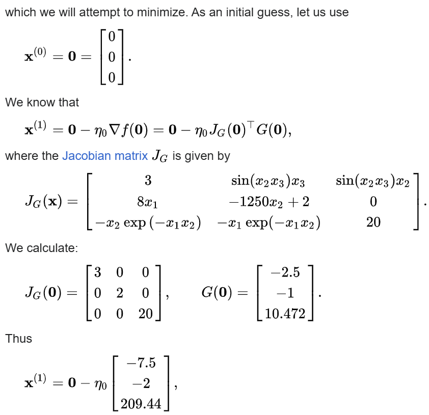

# Gradient descent 梯度下降

#### Gradient descent is a method(方法) for unconstrained(無束約的) mathematical optimization(數學最佳化). It is a first-order iterative algorithm(迭代演算法) for minimizing(最小化) a differentiable(可微分化的) multivariate function(多元函數).

### The idea is to take repeated steps(反覆迭代) in the opposite direction of the gradient(梯度的反方向) (or approximate gradient(近似梯度)) of the function(函數) at the current point(當前點), because this is the direction(方向) of steepest descent(最陡). Conversely(相反), stepping in the direction of the gradient(梯度方向) will lead to a trajectory(軌跡) that maximizes(最大化) that function; the procedure(過程) is then known as gradient ascent(梯度上升). It is particularly useful(特別好用) in machine learning(機器學習) for minimizing(最小化) the cost(成本函數) or loss(損失函數) function. Gradient descent should not be confused with **local search algorithms(局部搜尋演算法)**, although both are iterative methods(迭代方法) for optimization(優化).

---

## Description

### An analogy(類比) for understanding gradient descent
The basic intuition(基本直覺）behind gradient descent can be illustrated(闡述）by a hypothetical scenario（假設場景）. People are stuck(卡住) in the mountains and are trying to get down (i.e.(也就是說), trying to find the global minimum(全域最小值）). There is heavy fog(霧） such that visibility(能見度）is extremely(極為） low. Therefore(所以）, the path down the mountain is not visible, so they must use local information to find the minimum. They can use the method(方法）of gradient descent, which involves(涉及） looking at the steepness(陡峭度） of the hill at their current position(目前位置）, then proceeding(繼續）in the direction(方向）with the steepest(最陡峭）descent (i.e., downhill(下坡）). If they were trying to find the top of the mountain (i.e., the maximum), then they would proceed(繼續） in the direction of steepest ascent(上升） (i.e., uphill(上坡）). Using this method, they would eventually(最終） find their way down the mountain or possibly get stuck in some hole (i.e., local minimum or saddle point(鞍點）), like a mountain lake. However, assume(認為）also that the steepness(陡峭度） of the hill is not **"immediately obvious(顯而易見）"** with simple observation, but rather(相當）it requires(要求） a sophisticated(複雜的）instrument(工具、機械、儀器）to measure, which the people happen to have at that moment. It takes quite some time to measure the steepness of the hill with the instrument. Thus, they should minimize their use of the instrument if they want to get down the mountain before sunset. The difficulty then is choosing the frequency at which they should measure the steepness of the hill so as not to go off track.

In this analogy, the people represent the algorithm, and the path taken down the mountain represents the sequence of parameter settings that the algorithm will explore. The steepness of the hill represents the slope of the function at that point. The instrument used to measure steepness is differentiation. The direction they choose to travel in aligns with the gradient of the function at that point. The amount of time they travel before taking another measurement is the step size.

### Choosing the step size and descent direction

---

## Solution of a linear system(線型函數的解)
Gradient descent can be used to solve a **system of linear equations**

reformulated as a quadratic minimization problem. If the system matrix **_A_** is real symmetric and positive-definite, an objective function is defined as the quadratic function, with minimization of

so that

For a general real matrix **_A_**, linear least squares define

In traditional linear least squares for real **_A_** and **_b_** the Euclidean norm is used, in which case

### Geometric behavior and residual orthogonality

As shown in the image on the right, steepest descent converges slowly due to the high condition number of**_A_**, and the orthogonality of residuals forces each new direction to undo the overshoot from the previous step. The result is a path that zigzags toward the solution. This inefficiency is one reason conjugate gradient or preconditioning methods are preferred.

---

## Solution of a non-linear system(非線型系統)
Gradient descent can also be used to solve a system of nonlinear equations. Below is an example that shows how to use the gradient descent to solve for three unknown variables, **_x1_**, **_x2_**, and **_x3_**. This example shows one iteration of the gradient descent.

---

## Comments

#### Gradient descent works in spaces of any number of dimensions, even in infinite-dimensional ones. In the latter case, the search space is typically a function space, and one calculates the Fréchet derivative of the functional to be minimized to determine the descent direction.

#### That gradient descent works in any number of dimensions (finite number at least) can be seen as a consequence of the Cauchy–Schwarz inequality, i.e. the magnitude of the inner (dot) product of two vectors of any dimension is maximized when they are colinear. In the case of gradient descent, that would be when the vector of independent variable adjustments is proportional to the gradient vector of partial derivatives.

#### The gradient descent can take many iterations to compute a local minimum with a required accuracy, if the curvature in different directions is very different for the given function. For such functions, preconditioning, which changes the geometry of the space to shape the function level sets like concentric circles, cures the slow convergence. Constructing and applying preconditioning can be computationally expensive, however.

#### The gradient descent can be modified via momentums (Nesterov, Polyak, and Frank–Wolfe) and heavy-ball parameters (exponential moving averages and positive-negative momentum). The main examples of such optimizers are Adam, DiffGrad, Yogi, AdaBelief, etc.

---

## Modifications

#### Gradient descent can converge to a local minimum and slow down in a neighborhood of a saddle point. Even for unconstrained quadratic minimization, gradient descent develops a zig–zag pattern of subsequent iterates as iterations progress, resulting in slow convergence. Multiple modifications of gradient descent have been proposed to address these deficiencies.

### Fast gradient methods

### Momentum or heavy ball method

#### Trying to break the zig-zag pattern of gradient descent, the momentum or heavy ball method uses a momentum term in analogy to a heavy ball sliding on the surface of values of the function being minimized, or to mass movement in Newtonian dynamics through a viscous medium in a conservative force field. Gradient descent with momentum remembers the solution update at each iteration, and determines the next update as a linear combination of the gradient and the previous update. For unconstrained quadratic minimization, a theoretical convergence rate bound of the heavy ball method is asymptotically the same as that for the optimal conjugate gradient method.

#### This technique is used in stochastic gradient descent and as an extension to the backpropagation algorithms used to train artificial neural networks. In the direction of updating, stochastic gradient descent adds a stochastic property. The weights can be used to calculate the derivatives.
---

## Extensions

#### Gradient descent can be extended to handle constraints by including a projection onto the set of constraints. This method is only feasible when the projection is efficiently computable on a computer. Under suitable assumptions, this method converges. This method is a specific case of the forward–backward algorithm for monotone inclusions (which includes convex programming and variational inequalities).

#### Gradient descent is a special case of mirror descent using the squared Euclidean distance as the given Bregman divergence.

---

## Theoretical properties
#### The properties of gradient descent depend on the properties of the objective function and the variant of gradient descent used (for example, if a line search step is used). The assumptions made affect the convergence rate, and other properties, that can be proven for gradient descent. For example, if the objective is assumed to be strongly convex and lipschitz smooth, then gradient descent converges linearly with a fixed step size. Looser assumptions lead to either weaker convergence guarantees or require a more sophisticated step size selection.

---
## References
1. https://en.wikipedia.org/wiki/Gradient_descent
2. https://books.google.com.tw/books?id=iD5s0iKXHP8C&pg=PA131&redir_esc=y#v=onepage&q&f=false
3. https://web.stanford.edu/~boyd/cvxbook/bv_cvxbook.pdf#page=471
---

# [返回](../../ANN.md)