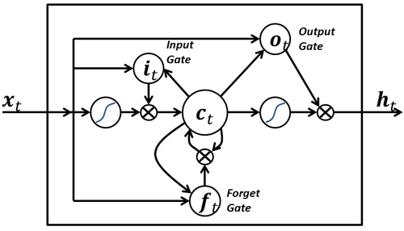
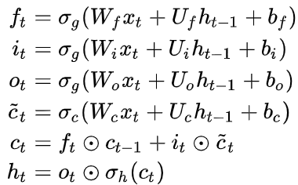
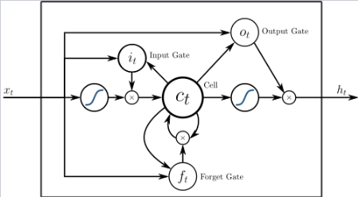
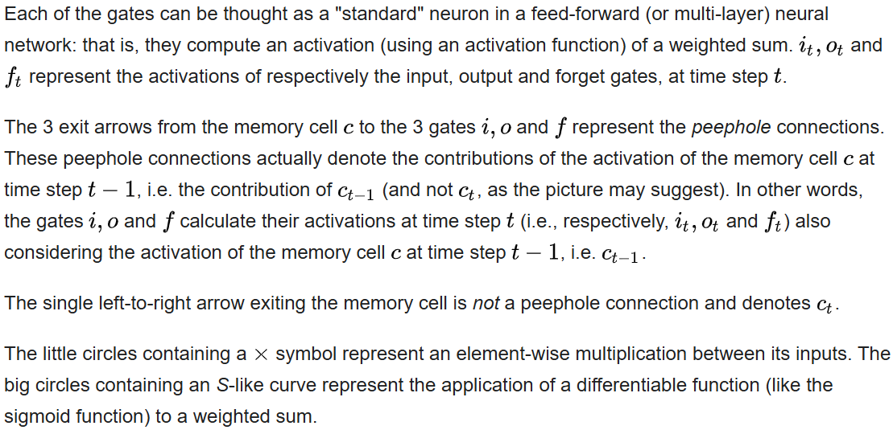
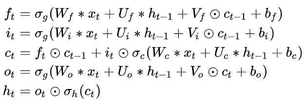

# Long Short-Term Memory / LSTM 長短期記憶神經網路

### 是現代深度學習中時間序列和序列分析的重要基礎結構

#### 用於解決"RNN"在長序列學習中梯度消失和梯度爆炸等問題，之後被廣泛應用於語音識別、語言建模、機器翻譯、情感分析、時間序列預測、醫療診斷和音樂生成...
#### 可作為複雜的非線性單元用於構造更大型

[About Gradient descent](./Gradient_descent.md)

---

### 結構與核心機制
#### 分成三個們和一個細胞狀態
  - 遺忘門（Forget Gate）：決定要遺忘多少來自前一狀態的資訊
  - 輸入門（Input Gate）：決定目前新進資訊中哪些部分要記錄到細胞狀態裡
  - 輸出門（Output Gate）：決定要從細胞狀態中輸出哪些資訊，作為當前序列的結果
  - 細胞狀態（Cell State）：像一條資訊通道，負責保存、傳遞和更新整個序列過程中的重要記憶
  

---

## Equation 方程

### Activation Function 激活函數

---

## Peephole LSTM 窺孔LSTM
- Peephole connections allow the gates to access the **constant error carousel (CEC) 恆定誤差輪播**, whose activation is the cell state.

## Peephole convolutional LSTM 窺孔卷積LSTM

The **"*"** denotes the **convolution operator 卷積算子**

---

## Training 訓練
- 使用 LSTM 單元的 RNN 可以在一組訓練序列上以監督方式進行訓練，使用**梯度下降**等優化演算法結合**時間反向傳播**來計算最佳化過程中所需的梯度，以便根據誤差（在 LSTM 網路的輸出層）相對於相應權重的導數比例改變 LSTM 網路的每個權重

### CTC score function 鏈結時間分類

透過CTC進行訓練，以找到一個 RNN 權重矩陣，該矩陣在給定相應輸入序列的情況下，最大化訓練集中標籤序列的機率。CTC 可同時實現對齊和辨識

### Alternatives 替代方案
**Neuroevolution 神經進化** or **policy gradient methods 策略梯度方法**

 延伸閱讀:Neuroevolution 神經進化 

# 加碼 : Neuroevolution 神經進化
- 使用**演化演算法(EP)**來產生ANN、參數和規則，最常用在**Artificial Life 人工生命, General game playing 一般遊戲 and Evolutionary robotics 進化機器人**。

- **主要優點**:神經演化可以比監督學習演算法應用得更廣泛，監督學習演算法需要正確的輸入和輸出，但 神經進化只​​需要衡量網路在某項任務中的表現

- 通常用作強化學習範式的一部分，它可以與使用固定拓撲的反向傳播（神經網路上的梯度下降）的傳統深度學習技術形成對比

---

## 特徵
- 一個常見的區別在於，有些演算法只進化固定**網路拓撲**的連接權重強度（有時稱為傳統神經進化），而有些演算法則同時進化網路拓撲及其**權重**（稱為 **TWEANN**，即拓撲和權重進化人工神經網路演算法）

- 對兩種方法進行單獨區分：一種是與參數並行演化 ANN 結構的方法（應用標準演化演算法），另一種是單獨演化 ANN 結構的方法（透過**迷因演算法(MA)**）

---
## Reference
1. https://en.wikipedia.org/wiki/Neuroevolution

---

## Reference 參考
1. https://static.googleusercontent.com/media/research.google.com/en//pubs/archive/43905.pdf
2. https://www.bioinf.jku.at/publications/older/3804.pdf
3. https://en.wikipedia.org/wiki/Long_short-term_memory#Training
4. https://en.wikipedia.org/wiki/Gradient_descent
5. https://en.wikipedia.org/wiki/Backpropagation_through_time
.
.
.
.
.
.

# [返回](../../ANN.md)