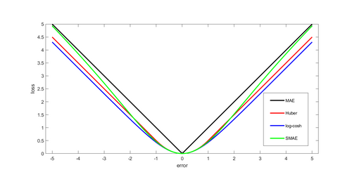
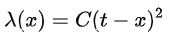
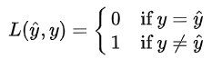
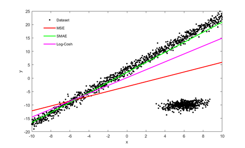
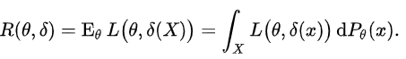
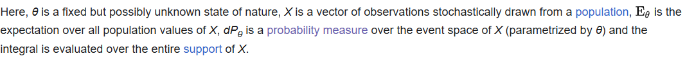
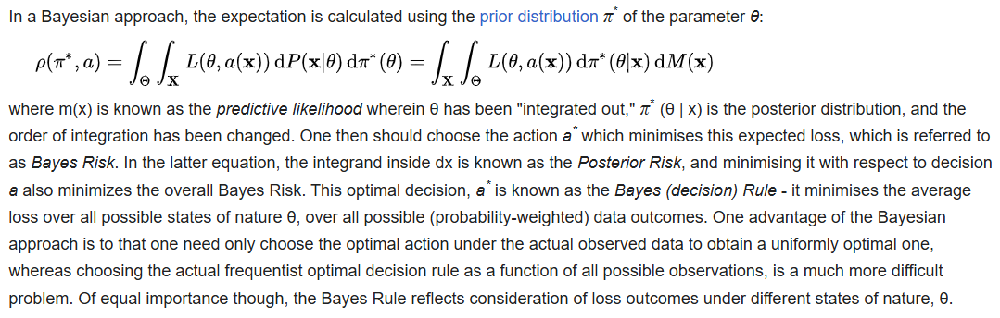
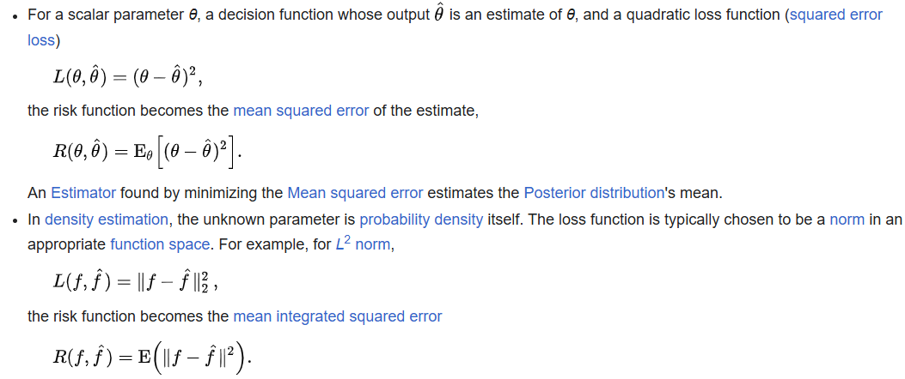
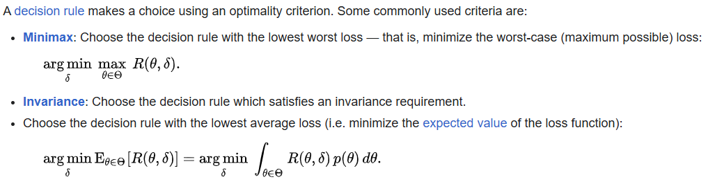
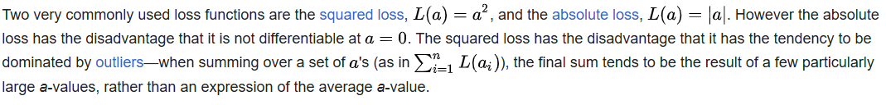

# Loss function 損失函數

#### In mathematical optimization and decision theory, a loss function or cost function (sometimes also called an error function) is a function that maps an event or values of one or more variables onto a real number intuitively representing some "cost" associated with the event. An optimization problem seeks to minimize a loss function. An objective function is either a loss function or its opposite (in specific domains, variously called a reward function, a profit function, a utility function, a fitness function, etc.), in which case it is to be maximized. The loss function could include terms from several levels of the hierarchy.

#### In statistics, typically a loss function is used for parameter estimation, and the event in question is some function of the difference between estimated and true values for an instance of data. The concept, as old as Laplace, was reintroduced in statistics by Abraham Wald in the middle of the 20th century. In the context of economics, for example, this is usually economic cost or regret. In classification, it is the penalty for an incorrect classification of an example. In actuarial science, it is used in an insurance context to model benefits paid over premiums, particularly since the works of Harald Cramér in the 1920s. In optimal control, the loss is the penalty for failing to achieve a desired value. In financial risk management, the function is mapped to a monetary loss.

---

## Examples

### **Regret**

#### Leonard J. Savage argued that using non-Bayesian methods such as minimax, the loss function should be based on the idea of regret, i.e., the loss associated with a decision should be the difference between the consequences of the best decision that could have been made under circumstances will be known and the decision that was in fact taken before they were known.

### Quadratic loss function

#### The use of a quadratic loss function is common, for example when using least squares techniques. It is often more mathematically tractable than other loss functions because of the properties of variances, as well as being symmetric: an error above the target causes the same loss as the same magnitude of error below the target. If the target is t, then a quadratic loss function is

#### for some constant C; the value of the constant makes no difference to a decision, and can be ignored by setting it equal to 1. This is also known as the **squared error loss (SEL)**.

#### Many common statistics, including t-tests, regression models, design of experiments, and much else, use least squares methods applied using linear regression theory, which is based on the quadratic loss function.

#### The quadratic loss function is also used in linear-quadratic optimal control problems. In these problems, even in the absence of uncertainty, it may not be possible to achieve the desired values of all target variables. Often loss is expressed as a quadratic form in the deviations of the variables of interest from their desired values; this approach is tractable because it results in linear first-order conditions. In the context of stochastic control, the expected value of the quadratic form is used. The quadratic loss assigns more importance to outliers than to the true data due to its square nature, so alternatives like the Huber, log-cosh and SMAE losses are used when the data has many large outliers.

### 0-1 loss function

#### In statistics and decision theory, a frequently used loss function is the 0-1 loss function

#### In information theory, this loss function is known as Hamming distortion.

---

## Constructing loss and objective functions

#### In many applications, objective functions, including loss functions as a particular case, are determined by the problem formulation. In other situations, the decision maker’s preference must be elicited and represented by a scalar-valued function (called also utility function) in a form suitable for optimization — the problem that Ragnar Frisch has highlighted in his Nobel Prize lecture. The existing methods for constructing objective functions are collected in the proceedings of two dedicated conferences. In particular, Andranik Tangian showed that the most usable objective functions — quadratic and additive — are determined by a few indifference points. He used this property in the models for constructing these objective functions from either ordinal or cardinal data that were elicited through computer-assisted interviews with decision makers. Among other things, he constructed objective functions to optimally distribute budgets for 16 Westfalian universities and the European subsidies for equalizing unemployment rates among 271 German regions.

---

## Expected loss

#### In some contexts, the value of the loss function itself is a random quantity because it depends on the outcome of a random variable **_X_**.

### **Statistics**

#### Both frequentist and Bayesian statistical theory involve making a decision based on the expected value of the loss function; however, this quantity is defined differently under the two paradigms.

### Frequentist expected loss

#### We first define the expected loss in the frequentist context. It is obtained by taking the expected value with respect to the probability distribution, Pθ, of the observed data, X. This is also referred to as the **risk function** of the decision rule δ and the parameter θ. Here the decision rule depends on the outcome of X. The risk function is given by:

### Bayes Risk

### Examples in statistics

### Economic choice under uncertainty

#### In economics, decision-making under uncertainty is often modelled using the von Neumann–Morgenstern utility function of the uncertain variable of interest, such as end-of-period wealth. Since the value of this variable is uncertain, so is the value of the utility function; it is the expected value of utility that is maximized.

---

## Decision rules

---

## Selecting a loss function

#### Sound statistical practice requires selecting an estimator consistent with the actual acceptable variation experienced in the context of a particular applied problem. Thus, in the applied use of loss functions, selecting which statistical method to use to model an applied problem depends on knowing the losses that will be experienced from being wrong under the problem's particular circumstances.

#### A common example involves estimating "location". Under typical statistical assumptions, the mean or average is the statistic for estimating location that minimizes the expected loss experienced under the squared-error loss function, while the median is the estimator that minimizes expected loss experienced under the absolute-difference loss function. Still different estimators would be optimal under other, less common circumstances.

#### In economics, when an agent is risk neutral, the objective function is simply expressed as the expected value of a monetary quantity, such as profit, income, or end-of-period wealth. For risk-averse or risk-loving agents, loss is measured as the negative of a utility function, and the objective function to be optimized is the expected value of utility.

#### Other measures of cost are possible, for example mortality or morbidity in the field of public health or safety engineering.

#### For most optimization algorithms, it is desirable to have a loss function that is globally continuous and differentiable.

#### The choice of a loss function is not arbitrary. It is very restrictive and sometimes the loss function may be characterized by its desirable properties. Among the choice principles are, for example, the requirement of completeness of the class of symmetric statistics in the case of i.i.d. observations, the principle of complete information, and some others.

#### W. Edwards Deming and Nassim Nicholas Taleb argue that empirical reality, not nice mathematical properties, should be the sole basis for selecting loss functions, and real losses often are not mathematically nice and are not differentiable, continuous, symmetric, etc. For example, a person who arrives before a plane gate closure can still make the plane, but a person who arrives after cannot, a discontinuity and asymmetry which makes arriving slightly late much more costly than arriving slightly early. In drug dosing, the cost of too little drug may be lack of efficacy, while the cost of too much may be tolerable toxicity, another example of asymmetry. Traffic, pipes, beams, ecologies, climates, etc. may tolerate increased load or stress with little noticeable change up to a point, then become backed up or break catastrophically. These situations, Deming and Taleb argue, are common in real-life problems, perhaps more common than classical smooth, continuous, symmetric, differentials cases.

---

## References

1. https://en.wikipedia.org/wiki/Loss_function

# [返回](../../ANN.md)