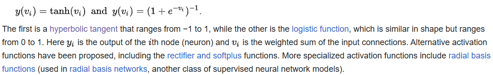
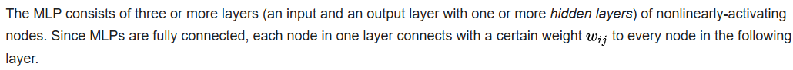
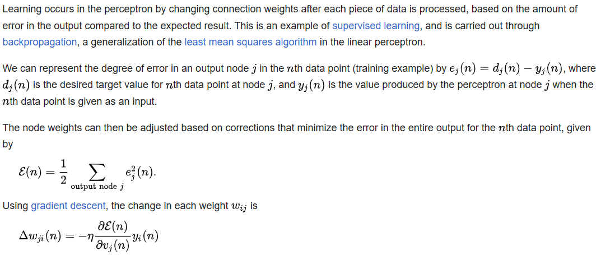
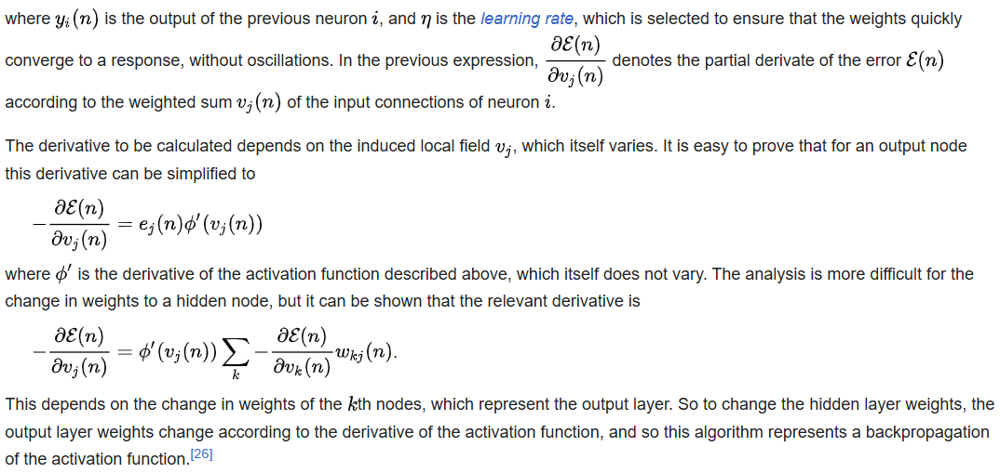

# Multilayer perceptron / MLP 多層感知器

#### In deep learning, a **multilayer perceptron (MLP)** is a kind of modern feedforward neural network consisting of fully connected neurons with nonlinear activation functions, organized in layers, notable for being able to distinguish data that is not linearly separable.

#### Modern neural networks are trained using backpropagation and are colloquially referred to as "vanilla" networks. MLPs grew out of an effort to improve on single-layer perceptrons, which could only be applied to linearly separable data. A perceptron traditionally used a Heaviside step function as its nonlinear activation function. However, the backpropagation algorithm requires that modern MLPs use continuous activation functions such as sigmoid or ReLU.

#### Multilayer perceptrons form the basis of deep learning, and are applicable across a vast set of diverse domains.

---

## Mathematical foundation

#### If a multilayer perceptron has a linear activation function in all neurons, that is, a linear function that maps the weighted inputs to the output of each neuron, then linear algebra shows that any number of layers can be reduced to a two-layer input-output model. In MLPs some neurons use a nonlinear activation function that was developed to model the frequency of action potentials, or firing, of biological neurons.
#### The two historically common activation functions are both sigmoids, and are described by

#### In recent developments of deep learning the rectified linear unit (ReLU) is more frequently used as one of the possible ways to overcome the numerical problems related to the sigmoids.

### Layers

### Learning

---

## References
1. [維基百科](https://en.wikipedia.org/wiki/Multilayer_perceptron) 

# [返回](../../ANN.md)