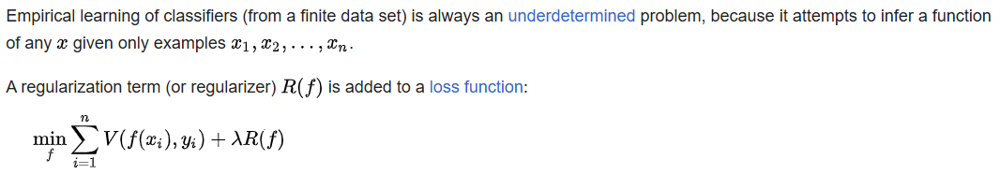
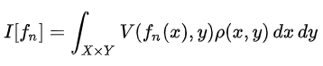
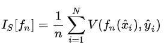
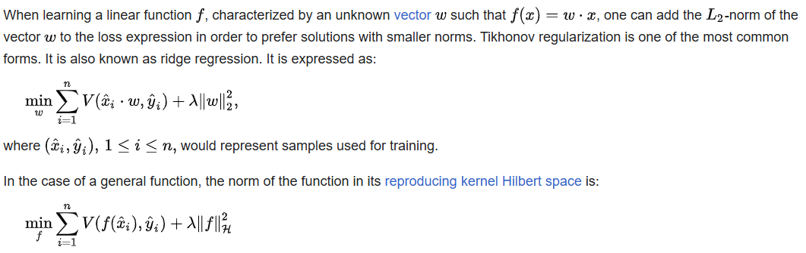

# Regularization 正則化

#### In mathematics, statistics, finance, and computer science, particularly in machine learning and inverse problems, regularization is a process that converts the answer to a problem to a simpler one. It is often used in solving **ill-posed** problems or to prevent overfitting.

 What is ill-posed problem ? 

## ill-posed problem means it's not a **well-posed problem** 

### What is well-posed problem ?
#### In mathematics, a well-posed problem is one for which the following properties hold:
##### 1. The problem has a solution
##### 2. The solution is unique(獨特的)
##### 3. The solution's behavior changes continuously with the initial conditions.

#### Although regularization procedures can be divided in many ways, the following delineation is particularly helpful:

##### - **Explicit regularization** is regularization whenever one explicitly adds a term to the optimization problem. These terms could be priors, penalties, or constraints. Explicit regularization is commonly employed with ill-posed optimization problems. The regularization term, or penalty, imposes a cost on the optimization function to make the optimal solution unique.

##### - **Implicit regularization** is all other forms of regularization. This includes, for example, early stopping, using a robust loss function, and discarding outliers. Implicit regularization is essentially ubiquitous in modern machine learning approaches, including stochastic gradient descent for training deep neural networks, and ensemble methods (such as random forests and gradient boosted trees).

#### In explicit regularization, independent of the problem or model, there is always a data term, that corresponds to a likelihood of the measurement, and a regularization term that corresponds to a prior. By combining both using Bayesian statistics, one can compute a posterior, that includes both information sources and therefore stabilizes the estimation process. By trading off both objectives, one chooses to be more aligned to the data or to enforce regularization (to prevent overfitting). There is a whole research branch dealing with all possible regularizations. In practice, one usually tries a specific regularization and then figures out the probability density that corresponds to that regularization to justify the choice. It can also be physically motivated by common sense or intuition.

#### In machine learning, the data term corresponds to the training data and the regularization is either the choice of the model or modifications to the algorithm. It is always intended to reduce the generalization error, i.e. the error score with the trained model on the evaluation set (testing data) and not the training data.

#### One of the earliest uses of regularization is Tikhonov regularization (ridge regression), related to the method of least squares.

---

## Regularization in machine learning

#### In machine learning, a key challenge is enabling models to accurately predict outcomes on unseen data, not just on familiar training data. Regularization is crucial for addressing overfitting—where a model memorizes training data details but cannot generalize to new data. The goal of regularization is to encourage models to learn the broader patterns within the data rather than memorizing it. Techniques like early stopping, L1 and L2 regularization, and dropout are designed to prevent overfitting and underfitting, thereby enhancing the model's ability to adapt to and perform well with new data, thus improving model generalization.

### **Early Stopping**

#### Stops training when validation performance deteriorates, preventing overfitting by halting before the model memorizes training data.

### **L1 and L2 Regularization**

#### Adds penalty terms to the cost function to discourage complex models:

#### - L1 regularization (also called LASSO) leads to sparse models by adding a penalty based on the absolute value of coefficients.

#### - L2 regularization (also called ridge regression) encourages smaller, more evenly distributed weights by adding a penalty based on the square of the coefficients.

### Dropout

#### In the context of neural networks, the Dropout technique repeatedly ignores random subsets of neurons during training, which simulates the training of multiple neural network architectures at once to improve generalization.

---

## Classification

#### where **_V_** is an underlying loss function that describes the cost of predicting **_f(x)_** when the label is **_y_**, such as the square loss or hinge loss; and **_λ_** is a parameter which controls the importance of the regularization term. **_R(f)_** is typically chosen to impose a penalty on the complexity of **_f_**. Concrete notions of complexity used include restrictions for smoothness and bounds on the vector space norm.

#### A theoretical justification for regularization is that it attempts to impose Occam's razor on the solution (as depicted in the figure above, where the green function, the simpler one, may be preferred). From a Bayesian point of view, many regularization techniques correspond to imposing certain prior distributions on model parameters.

#### Regularization can serve multiple purposes, including learning simpler models, inducing models to be sparse and introducing group structure[clarification needed] into the learning problem.

#### The same idea arose in many fields of science. A simple form of regularization applied to integral equations (Tikhonov regularization) is essentially a trade-off between fitting the data and reducing a norm of the solution. More recently, non-linear regularization methods, including total variation regularization, have become popular.

### Generalization

#### Regularization can be motivated as a technique to improve the generalizability of a learned model.

#### The goal of this learning problem is to find a function that fits or predicts the outcome (label) that minimizes the expected error over all possible inputs and labels. The expected error of a function **_fn_** is:

#### where **_X_** and **_Y_** are the domains of input data **_x_** and their labels **_y_** respectively.

#### Typically in learning problems, only a subset of input data and labels are available, measured with some noise. Therefore, the expected error is unmeasurable, and the best surrogate available is the empirical error over the **_N_** available samples:

#### Without bounds on the complexity of the function space (formally, the reproducing kernel Hilbert space) available, a model will be learned that incurs zero loss on the surrogate empirical error. If measurements (e.g. of **_xi_**) were made with noise, this model may suffer from overfitting and display poor expected error. Regularization introduces a penalty for exploring certain regions of the function space used to build the model, which can improve generalization.

---

## Tikhonov regularization (ridge regression)

#### These techniques are named for Andrey Nikolayevich Tikhonov, who applied regularization to integral equations and made important contributions in many other areas.

#### As the **_L2_** norm is differentiable, learning can be advanced by gradient descent. 

### Tikhonov-regularized least squares

#### During training, this algorithm takes **_O(d³+nd²)_** time. The terms correspond to the matrix inversion and calculating **_XTX_**, respectively. Testing takes **_O(nd)_** time.

---

## References
1. [維基百科](https://en.wikipedia.org/wiki/Regularization_(mathematics))
2. https://www.mdpi.com/2227-9091/8/2/40

# [返回](../../ANN.md)