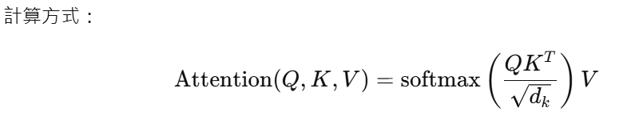

# 神經網路架構速覽

# 主要元件（簡潔）

## 層（Layer）：Dense/Linear、Conv、RNN、Self-Attention。

### 層（Layer）是神經網路中的基本運算單元，用來把輸入轉換成輸出，並逐層抽取或組合特徵。簡要說明：

- 可以想像神經網路就像是一個「多層的數學函數」，每一層都會**接收輸入** → **做運算** → **傳出結果**。

### 基本數學形式

許多層可表示為 y = f(Wx + b)（可訓練參數 W, b；f 為啟動函數）。
有些層是無參數的（例如 MaxPool、Flatten、Activation 若單獨算作層）。
常見層類型（用途與特性）

- ### 基礎結構層:

- **Dense / Fully‑connected(全連接層)**：最基本的層，每個輸入連到每個輸出；適合**表格資料、分類/回歸**。

```python
from tensorflow.keras.layers import Dense

layer = Dense(units=64, activation='relu')
```
---

- **Convolution（Conv）(卷積層)**：用卷積核在局部窗口計算，保留空間結構，**常用於影像**。

```python
from tensorflow.keras.layers import Conv2D

layer = Conv2D(filters=32, kernel_size=(3,3), activation='relu')
```
---

- **Pooling（MaxPool / AvgPool）(池化層)**：空間下採樣，減少尺寸與平移不變性。ex: **MaxPooling（取最大值）、AveragePooling（取平均值）**

```python
from tensorflow.keras.layers import MaxPooling2D

layer = MaxPooling2D(pool_size=(2,2))
```
---

- **Dropout (隨機丟棄層)**：訓練時隨機丟棄神經元，做正則化（無參數），防止模型過度學習。
```python
from tensorflow.keras.layers import Dropout

layer = Dropout(0.5)
```
---

- ### 中高階層:

- **Recurrent（RNN / LSTM / GRU）(循環層)**：
 用來處理「序列資料」的層，例如**文字、時間序列、語音**。
 
- 普通的Dense只看**當前輸入** = 沒有記憶，但語句有順序的，這就靠「hidden state」來實現

🔹 RNN / LSTM / GRU 差異

RNN	最基本，會記錄前一個 hidden state，缺點是:**容易「梯度消失」**
LSTM，加入「記憶單元」（cell state），能長期記憶，缺點是:**結構較複雜**
GRU，LSTM 的簡化版本，效能相近、速度更快，缺點是:**少一個門(no cell state)**

```python
from tensorflow.keras.layers import SimpleRNN, LSTM, GRU

# RNN
rnn = SimpleRNN(64, activation='tanh', return_sequences=True)# return_sequences=True → 表示輸出每個時間步的結果

# LSTM
lstm = LSTM(128, return_sequences=False)# False → 只輸出最後一個（常用於分類）

# GRU
gru = GRU(128, return_sequences=True)
```


- **Attention / Self‑Attention**：以注意力機制建模序列中元素間的關聯（Transformer）。
用於建模序列中「元素彼此間的關聯性」。
是 **Transformer（GPT、BERT 等）**的關鍵技術。

#### RNN 雖然能記住前文，但記憶會「衰退」；Attention 可以直接「比較序列中所有位置」
- #### 核心概念:
  每個輸出產生三個向量: **QKV**
    Q（Query）：我要關注什麼
    K（Key）：我能提供什麼資訊
    V（Value）：實際資訊內容
    

當 Q, K, V 都來自同一組輸入時 → **Self-Attention**
這讓模型能自己「看整句話」Ex:“The **animal** didn’t cross the street because **it** was too tired.”
模型會知道 “it” 指的是 “animal”，因為注意力讓每個詞都能「關注」句中其他詞。

#### 多頭注意力（Multi-Head Attention）
用多組(Q,K,V)進行
```python
from tensorflow.keras.layers import MultiHeadAttention

attn = MultiHeadAttention(num_heads=8, key_dim=64)
output = attn(query=x, value=x, key=x)  # self-attention
```
---


- **Normalization（BatchNorm / LayerNorm）**： **✨標準化激活值**

- 1.**Batch Normalization**
在 小批次資料（batch） 維度上標準化，通常用於**CNN、MLP**
```python
from tensorflow.keras.layers import BatchNormalization

bn = BatchNormalization()
```


- 2.**Layer Normalization**
在 特徵維度 上標準化（不依賴 batch 大小），更適合 **Transformer、RNN**。
```python
from tensorflow.keras.layers import LayerNormalization

ln = LayerNormalization()
```
- BatchNorm，對整個 batch 的輸入平均，用在:**CNN、MLP**
- LayerNorm，對每個樣本的所有特徵平均，用在:**Transformer、RNN**

---


### 輸入/輸出形狀（shape）觀念

- **Dense**：輸入 (batch, in_dim) → 輸出 (batch, out_dim)。

- **Conv2D**：輸入 (batch, C, H, W) → 輸出 (batch, C_out, H', W')（依 kernel、stride、padding 決定 H', W'）。

- **RNN**：輸入 (seq_len, batch, feature) 或 (batch, seq_len, feature) → 輸出含時間維度。
層的角色與設計要點

每層學到不同層次的表示（淺層學局部/低階特徵，深層學抽象/高階特徵）。
層的順序與種類決定網路能力與計算量（例如 Conv→Pool→Conv→Flatten→Dense）。
小心參數數量（過多會過擬合、過少表達力不足）；搭配正則化與適當深度。  

## 啟動函數：ReLU、Sigmoid、Tanh、GELU。  

## 損失函數：分類→Cross-Entropy，回歸→MSE。  
## 優化器：SGD、Adam（常用）。  
## 正則化：Dropout、BatchNorm/LayerNorm、L2（權重衰減）。  
## 評估指標：Accuracy、F1、ROC-AUC、MAE/MSE。

## 常見架構（用途與重點）
- MLP（多層感知器）：表格資料、簡單分類/回歸。  
- CNN（卷積網路）：影像、局部特徵擷取、池化與卷積核設計很重要。  
- RNN / LSTM / GRU：序列資料（文字、時間序列）。  
- Transformer（自注意力）：NLP 與序列建模，具平行化與長距離依賴處理能力。  
- Autoencoder：降維、去噪、表示學習。  
- GAN：生成模型，訓練需注意不穩定性與模式崩潰。  
- GNN：處理圖結構資料（消息傳遞）。

## 設計與調參要點（實務重點）
- 先從小模型與少量層開始，逐步擴大。  
- 學習率最敏感：使用 lr 調度、warmup。  
- 使用 BatchNorm/LayerNorm 幫助穩定與加速收斂。  
- 避免過擬合：資料擴增、Dropout、早停（early stopping）。  
- batch size 與 lr 相關，可用線性縮放原則調整。  
- 分訓練/驗證/測試集，確保評估可靠性。

## 簡短範例（PyTorch）

```python
import torch
import torch.nn as nn
import torch.nn.functional as F

class SimpleMLP(nn.Module):
    def __init__(self, input_dim, hidden=128, num_classes=10):
        super().__init__()
        self.fc1 = nn.Linear(input_dim, hidden)
        self.fc2 = nn.Linear(hidden, num_classes)
    def forward(self, x):
        x = F.relu(self.fc1(x))
        return self.fc2(x)

class SimpleCNN(nn.Module):
    def __init__(self, num_classes=10):
        super().__init__()
        self.conv1 = nn.Conv2d(3, 32, 3, padding=1)
        self.conv2 = nn.Conv2d(32, 64, 3, padding=1)
        self.pool = nn.MaxPool2d(2)
        self.fc = nn.Linear(64*8*8, num_classes)  # 假設輸入 32x32
    def forward(self, x):
        x = F.relu(self.conv1(x))
        x = self.pool(F.relu(self.conv2(x)))
        x = x.view(x.size(0), -1)
        return self.fc(x)
```

## Transformer Encoder（簡骨架）
```python
import torch.nn as nn

class SimpleTransformerEncoder(nn.Module):
    def __init__(self, d_model=512, nhead=8, num_layers=6):
        super().__init__()
        encoder_layer = nn.TransformerEncoderLayer(d_model=d_model, nhead=nhead)
        self.encoder = nn.TransformerEncoder(encoder_layer, num_layers=num_layers)
    def forward(self, src, src_mask=None):
        # src shape: (seq_len, batch, d_model)
        return self.encoder(src, mask=src_mask)
```

---

